# COMP0035 Tutorial 1: Intro to using Git and GitHub; and setting up a project in your IDE

## Pre-requisites

You must have completed the following before attending the tutorial.

There will not be sufficient time to do this in the session.

1. Check that you have installed:
    - Python
    - Git
    - a Python IDE. Visual Studio Code or PyCharm Professional
      version ([free license with a student account](https://www.jetbrains.com/lp/leaflets-gdc/students/)) are
      suggested.
2. You should have created a GitHub
   account. [Sign up for free student account to get GitHub Pro](https://github.com/education/students).

## Introduction

This session introduces you to using Git, GitHub and GitHub Classroom. It then walks through setting up a project in an
IDE. The learning objective is that you should have sufficient knowledge to create a project in your IDE for your
coursework.

This class will not be sufficient to teach you the full use of Git, GitHub and their integration with your chosen code
editor or IDE. There are also video tutorials and guides in the Reading List. The best way to learn is to
keep using Git and GitHub throughout the COMP0035 and COMP0034 projects.

You can work with GitHub using a git command line from a terminal; directly on GitHub.com or using any number of source
code control software. In COMP0034 and COMP0035 it is assumed you will mostly work with GitHub using your IDE (VS Code,
PyCharm etc.) so this tutorial focuses on this method.

There are different ways to create a GitHub repository including:

1. Create a new empty repository directly on GitHub.com
2. Push existing code from a project on your computer to GitHub
3. Accept an assignment from GitHub classroom
4. Fork an existing GitHub repository

The two approaches you are most likely to use in the course are:

**Accept an assignment from GitHub Classroom** - used for the Coursework

1. Create your own copy of a repository by accepting a GitHub Classroom assignment. This creates a remote copy of the
   repository in the ucl-comp0035 organisation.
2. Clone this remote copy from GitHub to your IDE to create a project with a local repository
3. Create a virtual environment for the project (local repository) in your IDE
4. Edit code in the IDE and push changes from your local repository to the remote repository on GitHub

**Fork an existing GitHub repository** - used for the Tutorials (Coding practicals)

1. Fork the course repository for the tutorials. This creates a remote copy of the repository in your GitHub account.
2. Clone the repository to your IDE to create a project
3. Create a virtual environment for the project in your IDE
4. Edit code in the IDE and push changes to the remote repository

The tutorial will cover these steps in more detail.

## Contents

**Note: The screenshots in the following pages provide a guide but may not exactly match your computer screen**. They
show
various repositories (not necessarily those in the instructions); and the interfaces to GitHub, PyCharm and VSCode vary
in different versions and on different operating systems.

1. [Create a repository directly on GitHub (10 mins)](#create-a-new-repository-directly-on-github)
2. [Create a repository using GitHub Classroom (10 mins)](#create-a-repository-by-accepting-a-github-classroom-assignment)
3. [Create a repository by forking a GitHub repository (5 mins)](#create-a-repository-by-forking-a-github-repository)
4. [Find a repository in GitHub (5 mins)](#find-a-repository-in-github)
5. [Integrate your IDE with your GitHub account (10 mins)](#integrate-your-ide-with-your-github-account)
6. [Clone a repository to create a project in your IDE (5 mins)](#create-a-clone-of-a-repository-in-your-ide)
7. [Create a virtual Python environment for a project in your IDE](#create-and-activate-a-virtual-environment)
8. [Make and push a change to the remote repository (5 mins)](#commit-and-push-changes-to-the-remote-repository-on-github)
9. [Apply the knowledge to setup your coursework project](#apply-the-knowledge-to-create-and-set-up-your-coursework-project)
10. [Next steps](#next-steps)

## Create a new repository directly on GitHub

You should learn this method, though you will not use it for the coursework or tutorials.

### Instructions

Instructions are also
available [in the GitHub documentation](https://docs.github.com/en/get-started/quickstart/create-a-repo).

1. Login to [GitHub](https://github.com/login)
2. At the top right of the GitHub interface find the **+** button and use the dropdown to select New Repository.
    - Alternative option: Click on the 'Respositories' link in the top menu bar. Then on the 'Repositories' page find
      the green button marked 'New' and select it.
3. Complete the following:
    1. **Repository name**: Type a short, memorable name for your repository, e.g. "hello-world".
    2. **Description (optional)**: Optional, you can add a description of your repository, e.g. "My first repository on
       GitHub."
    3. Select **Private**: Private means only you or anyone you later add as a
       collaborator can see your repository. If you choose Public anyone can see your code. Choosing Private is expected
       for coursework to avoid issues with plagiarism.
    4. Select **Add a README file**
    5. Select **Add .gitignore** and click on the dropdown. In the Filter box start typing Python and you should find it
       and then click on Python.
    6. **Choose a license** is optional. A license tells other developers whether and how they can use your code.
4. Click **Create repository**.

## Create a repository by accepting a GitHub Classroom assignment

GitHub Classroom provides a way for you to create repository so that it can then be accessed by yourself, the course
tutor and PGTAs.

You can directly access the classroom, though you don't need to do this as you will be given a link to the classroom
assignments when you need to use it.

All coursework repositories for COMP0034 and COMP0035 are created using GitHub Classroom.

You click on a URL that creates a copy of a template repository with some starter files that you will need for the
coursework.

Repositories that are created this way are stored in an organisation called **ucl-comp0035**, not in your personal
GitHub account. They are created as **private** which in this case means _you, the course tutor and PGTAs_ can see
your code; but not any other students.

### Instructions

1. Login to [GitHub](https://github.com/login)
2. After you log in, click on this practice GitHub classroom assignment
   link: [https://classroom.github.com/a/fziiZ53-](https://classroom.github.com/a/fziiZ53-).
3. The first time that you use GitHub classroom you need to:
    - authorise your GitHub account to use GitHub Classroom
    - join the organisation that owns the classroom, ucl-comp0035
    - If you see the following please authorise the classroom:

   

    - If you see the following then click on the green button to join the organisation:

   You should see something similar to the following:

   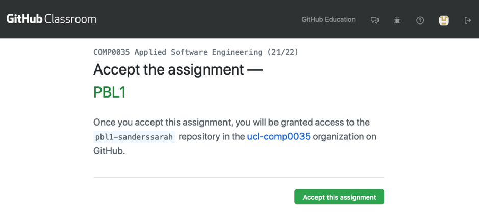

4. Press ‘Accept this assignment’. It may take a minute for the repository to be created, and you will need to refresh
   the browser page to see when it has finished – it won’t automatically show you when it finishes!

   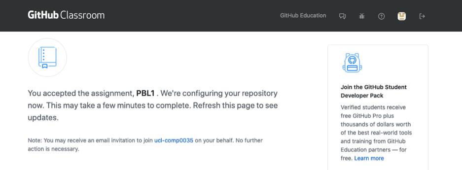

   Once finished it will look something like this:

   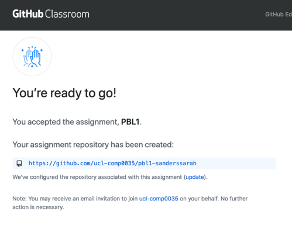

If you click on the link in the refreshed screen it should go to the newly created repository.

## Find a repository in GitHub

The first repository ('hello-world') you created is in your GitHub account.

The second repository ('practice') you created is in the ucl-comp0035 organisation.

While you own both of these, where you will find them is different.

### Instructions

If you are not already logged in then [login in to GitHub](https://github.com/login).

1. To find the first repository in your GitHub account

    1. Find the menu in the top right of the view by clicking on your profile image:

   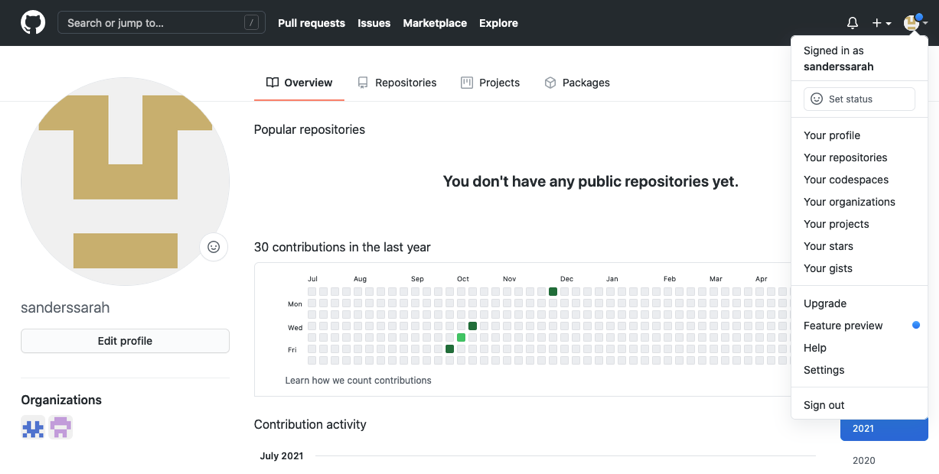

    2. Select **Your repositories** from the drop-down.

   You should see the 'hello-world' repo you created in the first activity. You will not see the 'practice' repo that
   you created in the second activity.

2. To find the second repository you created in the ucl-comp0035 organisation

    1. Select **Your organizations** and then select the **ucl-comp0035** organisation.

   If you don’t see **Your organisations** then you may be a collaborator rather than a member of the ucl-comp0035
   organisation. If this is the case then go to <https://github.com/ucl-comp0035>, and you should see your repo listed.

   Another way to access the organisation is to click on the organisation icon in the bottom left of the screenshot
   shown above – hover on the icons and the name will display. You should then see the `practice` repository listed, and
   you can click on the link to access it:

   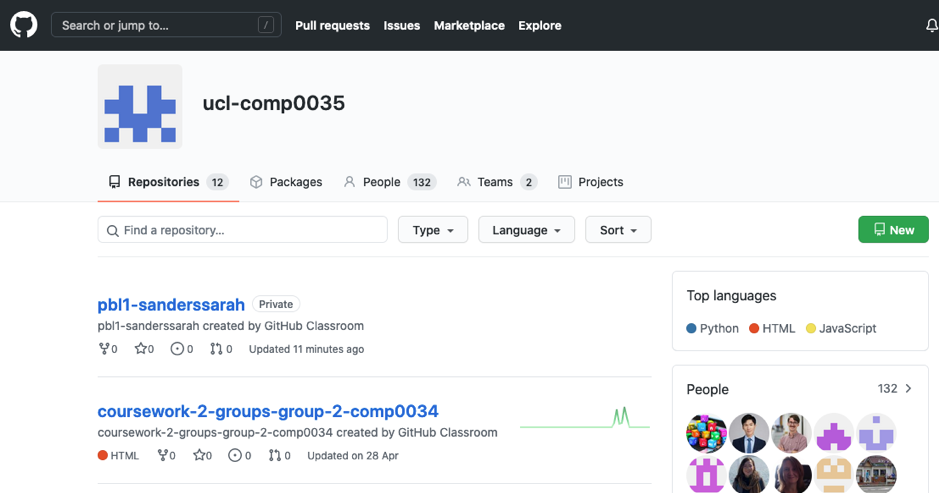

## Integrate your IDE with your GitHub account

Most of the time you will be creating and editing files in your IDE and so you need to enable it to work with GitHub to
manage your code.

You will be adding authorisation in GitHub to allow your IDE to access your GitHub account. It is likely to do this
using
a [GitHub personal access token](https://docs.github.com/en/authentication/keeping-your-account-and-data-secure/managing-your-personal-access-tokens)
.

How you integrate your IDE with GitHub is specific to the particular IDE, so follow the relevant documentation to
complete this:

- [VS Code GitHub documentation](https://code.visualstudio.com/docs/editor/github)
- [PyCharm Register an existing account with a token](https://www.jetbrains.com/help/pycharm/github.html#ef23dd64)

### Notes on VS Code

If you are prompted to authorise your IDE to access GitHub then please accept e.g. the following shows the screens you
may see using VS Code:

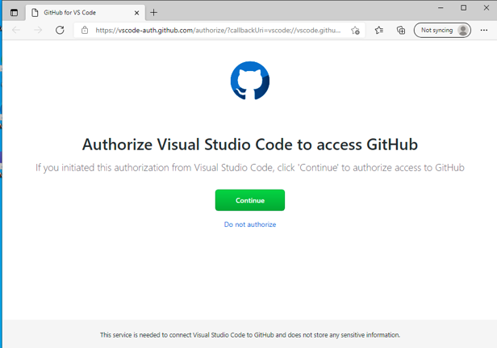

If you are not already logged in to GitHub you will be prompted to log in and then Authorise GitHub:

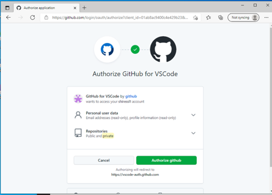

I experienced the following error message:

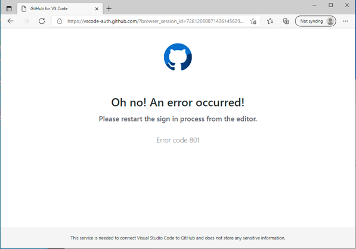

On repeating the steps I then accepted the following and was successful:

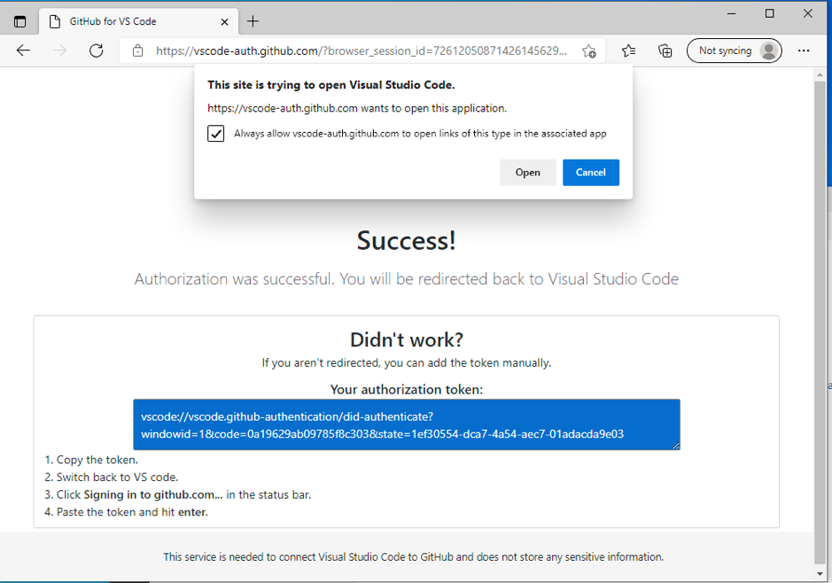

Select open if you get this:

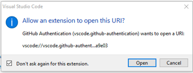

The process automatically generated the token which you need to copy before closing this screen. Follow the 4 steps show
in the image above:

1. Copy the token
2. Switch back to VS Code
3. Click `Signining in to github.com…` in the status bar
4. Paste the token and hit enter

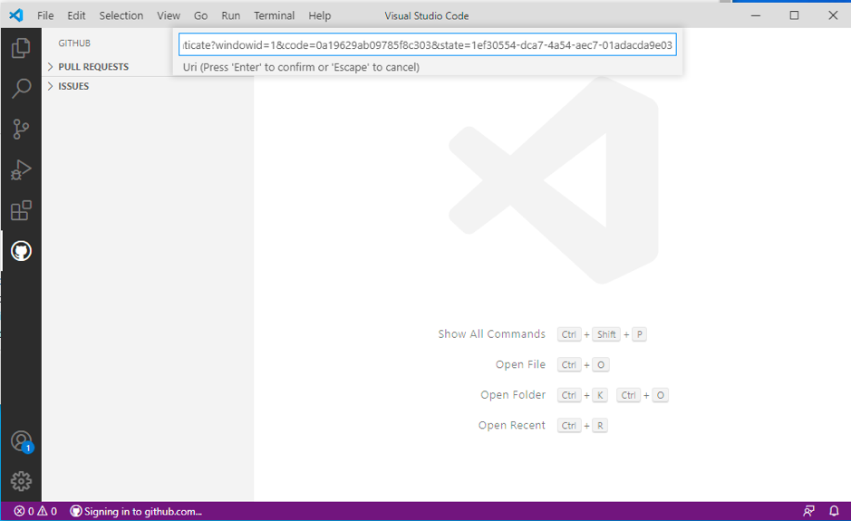

#### VS Code Pull Requests and Issues extension

In VS Code you were asked to install the GitHub Pull Requests and Issues extension.

Pull requests are a mechanism when working with others to tell them about changes you pushed to a branch so others can
review your changes before the branch is merged to the main, or base, branch.

Working with branches is not covered in this tutorial.

## Create a clone of a repository in your IDE

When you create a repository on GitHub.com, it exists as a remote repository. You can edit files
directly on GitHub however this is not recommended as you will miss the benefits of an IDE such as auto-complete, error
checking and code AI.

Instead, you
will [clone a repository](https://docs.github.com/en/github/creating-cloning-and-archiving-repositories/cloning-a-repository-from-github/cloning-a-repository)
. This creates a local copy of the repository on your computer. You then need to sync between the two locations.

If you have integrated your IDE and GitHub you should be able to follow the IDE's instructions and enter the repository
name by entering the owner and the repository name e.g.

- `ucl-comp0035/comp0035-practice`
- `yourusername/hello-world`

If you have not been able to integrate your IDE with GitHub, you may need to find the URL of the repository. In GitHub
copy the URL for the repository. To do this, open your 'practice' repository, select **Code** and then copy the URL to
the clipboard.

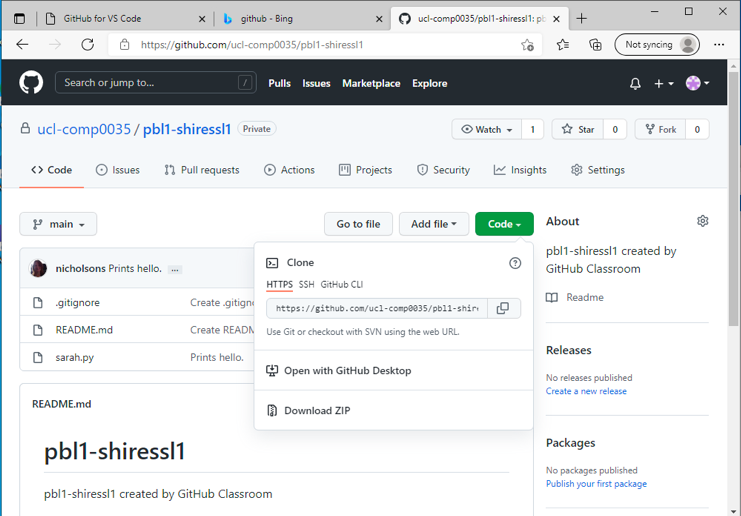

> ACTION: Follow the guidance for your IDE to clone the 'practice' repository'.

- [PyCharm documentation](https://www.jetbrains.com/help/pycharm/manage-projects-hosted-on-github.html#clone-from-GitHub)
- [VS Code documentation](https://code.visualstudio.com/docs/sourcecontrol/github#_cloning-a-repository)

## Setting up a Python environment in your IDE

As well as the code files, you need a working Python environment to run the code.

You can use your base Python environment, but it is better to create a virtual environment for each project. This way
you can install the specific versions of libraries you need for the project without affecting other projects.

There are also a few typical files that you need to create and know the purposes of:

- requirements.txt
- pyproject.toml
- README.md
- .gitignore

### Create and activate a virtual environment

There are a few ways to do this.

VS Code and Pycharm have built-in tools to create and manage virtual environments. See

- [VS Code Python environments](https://code.visualstudio.com/docs/python/environments)
- [PyCharm Python environments](https://www.jetbrains.com/help/pycharm/creating-virtual-environment.html)

You can also create a virtual environment from the command line using the Terminal tool window in either VS Code or
PyCharm.

In the Terminal window, enter the commands for your operating system that are
given [in this link](https://packaging.python.org/en/latest/guides/installing-using-pip-and-virtual-environments/#create-and-use-virtual-environments).

e.g for MaxOS and Unix:

```bash
python3 -m venv .venv
source .venv/bin/activate
```

e.g. for Windows:

```bash
py -m venv .venv
.venv\Scripts\activate
```

> ACTION: Create and activate a virtual environment for the 'practice' project.

### Configure the Python virtual environment in your IDE

#### pip

`pip` is a Python tool for installing packages in Python environment. You can install one or more packages at once,
upgrade packages and
delete them. Read more on [pip here](https://pip.pypa.io/en/stable/user_guide/).

You can find published Python packages on [the Python Package Index, PyPi](https://pypi.org)

`pip` is not the only tool used to manage Python packages. There are others such as `conda` and `poetry`. If you wish to
learn these instead of `pip`, then you are welcome to do so.

#### requirements.txt

`requirements.txt` is a file that lists the additional libraries that are required for the project.

You can install all the libraries in the virtual environment using the Terminal in your IDE and `pip` using the command:

```bash
pip install -r requirements.txt
```

You can update the requirements.txt file with new libraries or different versions by editing the file. The requirements
file format
is [documented here](https://pip.pypa.io/en/stable/reference/requirements-file-format/#requirements-file-format).

> ACTION: In your 'practice' project, use pip to install the libraries in the requirements.txt file.

### pyproject.toml

`pyproject.toml` is a file that is used to specify the build system requirements for the project to allow other
developers to build and run your code. It can be used to manage dependencies, instead of requirements.txt, however it
does more than 'requirements.txt' does.

For this course, you need to a way to install the code from your project in development or editable mode. To do this you
use a combination of `pip`, `setuptools` and `pyproject.toml`.

You will create a pyproject.toml file in the coursework project. there are many aspects that can be figured, a typical
minumum for the coursework is:

```toml
# Basic project information
[project]
name = "hello-world-sample-project"
version = "2024.0.0"

# Most students will use setuptools, though poetry is also an option
[build-system]
requires = ["setuptools >= 61.0"]
build-backend = "setuptools.build_meta"

# Setuptools configuration see https://setuptools.pypa.io/en/latest/userguide/pyproject_config.html#setuptools-specific-configuration
[tool.setuptools.packages.find]
where = ["src"]  # list of folders that contain the packages (["."] by default)
include = ["my_package*"]  # package names should match these glob patterns (["*"] by default)
exclude = ["my_package.tests*"]  # exclude packages matching these glob patterns (empty by default)
```

More on [pyproject.toml here](https://packaging.python.org/en/latest/guides/writing-pyproject-toml/).

Packages are likely to include specific guidance for pyproject.toml. Initially you many need to refer to
the [setuptools configuration](https://setuptools.pypa.io/en/latest/userguide/pyproject_config.html), and later in the
course [pytest configuation](https://docs.pytest.org/en/6.2.x/customize.html#pyproject-toml).

To use pyproject.toml to install your code in editable or development mode, use the Terminal window and enter
the command:

```bash
pip install -e .
```

Note that the '.' at the end of the command is the path to the directory containing the pyproject.toml file; in this
case in the root of the project.

> ACTION: use the `pip install -e .` command in the 'practice' project.

### .gitignore

A `.gitignore` file is used to tell Git (the underlying version control software that GitHub uses) which files should
not be tracked in the repository. For example, you don’t want to track configuration files that are specific to the code
editor or IDE (e.g. VS Code), particularly when collaborating with others in a repo, as each person is likely to have a
different local config (Windows v. Mac, file locations etc.). If you don’t exclude these files from GitHub, then you may
unintentionally cause problems for each other by overwriting each other’s IDE configuration when you commit and push
changes to the repo. You also don’t want to track common python files such as the virtual environment for your project.

In the two repositories you created earlier, the `.gitignore` was added directly in GitHub. You can also create it in
your IDE; further PyCharm and VS Code have plugins that you can add that will make it easier to create standard
.gitgnore from templates.

- [VS Code .gitignore extensions](https://code.visualstudio.com/docs/editor/versioncontrol#_scm-provider-extensions)
- [Pycharm create .gitignore](https://www.jetbrains.com/help/pycharm/set-up-a-git-repository.html#ignore-files) or a
  third party plugin such as [.ignore](https://plugins.jetbrains.com/plugin/7495--ignore).

#### Edit README.md

`README.md` tells other developers important information about your repo such as what the repo contains, any set-up
instructions etc. You need to edit this for your coursework to explain to the markers anything they need to know to
set-up and run your code.

`.md` means it is a markdown format. Markdown is widely used for documentation of code. It is not difficult to learn,
you just need a few basic syntax rules. Refer to
the [GitHub markdown guide](https://docs.github.com/en/get-started/writing-on-github/getting-started-with-writing-and-formatting-on-github/basic-writing-and-formatting-syntax).

1. Navigate to README.md file in the 'practice' repository and open it.
2. Make some changes, e.g.:

    - Change the first level heading from "comp0035-practice" to "Practice".
    - Add a second level heading e.g. "Introduction"
    - Add a line of text e.g. "This repository is for learning to use GitHub"

   ```markdown
   # A level 1 heading

   ## A level 2 heading

   Some text
   ```
3. Save the file.

## Commit and push changes to the remote repository on GitHub

Currently, you have a **local** copy (clone) of the remote master repository.

We have not created any branches, so you will be working in the 'main' branch.

VS Code version:

1. Create a Python file in your IDE. There are different ways to do this (e.g. File > New). In VS Code the following
   used
   the icon (a page with a + symbol) below and entered the filename as `temp.py`:

   
2. Add a line of code to the file. [VS Code editing code](https://code.visualstudio.com/docs/python/editing).

   e.g. `print("this is a temporary file")`

3. To add the file to be tracked by source code:
    - [PyCharm](https://www.jetbrains.com/help/pycharm/adding-files-to-version-control.html)
    - VSCode: Find the source code control icon in the left menu bar and expand the **Changes** section

   

4. To add the file to be tracked select the **+** symbol next from the icons to the right of the file name which will
   stage the changes (this _adds_ the file and starts the commit step).

5. Add a commit message (see the Message box under the Source Control heading in the image below) and press the drop
   down arrow at the edge of the blue 'Commit' button and select 'Commit and Push'.

   

   > Previously some students got an error message warning that you need to set your username and email. If this happens
   then [follow the instructions here](https://docs.github.com/en/get-started/getting-started-with-git/setting-your-username-in-git)
   . You can then **sync with GitHub** which carries out a pull and a push.
   > 
   > Synchronise is also available using the circular arrow icon show in the bottom left of the image below:
   > 

6. You should now see the changes in GitHub with your commit message (e.g. 'Added temp' in the image below):

   

For PyCharm, the approach is the same but the instructions for the steps is different:

- Create a Python file (e.g. File > New) and give it a name.
- [Add Python code to the file](https://www.jetbrains.com/help/pycharm/creating-and-running-your-first-python-project.html#edit-file)
- [Add the new file to be tracked by Git](https://www.jetbrains.com/help/pycharm/adding-files-to-version-control.html)
- [Commit and push changes](https://www.jetbrains.com/help/pycharm/commit-and-push-changes.html)

#### Pull changes from GitHub

This step is to `pull` any changes that are in GitHub before you push your committed changes. For example, you may have
edited a file directly in GitHub, or someone else may have pushed a recent change to your GitHub repository.

If you want to simulate this, go to your repository on GitHub.com and add a new file to the repository.


Then save the file which commits the change.


Switch back to your IDE.

Now _pull_ the changes from GitHub to the local repository in the IDE and then _push_ the changes you made to the local
repository to the remote repository on GitHub.  :

- [PyCharm pull changes](https://www.jetbrains.com/help/pycharm/sync-with-a-remote-repository.html#pull)
  and [PyCharm push changes](https://www.jetbrains.com/help/pycharm/commit-and-push-changes.html#push)
- [VS Code push and pull remote changes](https://code.visualstudio.com/docs/sourcecontrol/intro-to-git#_pushing-and-pulling-remote-changes)

You should now see the 'dummy.txt' file in your local repository as well; and you should see the changes you made to
README.md on GitHub.

## Apply the knowledge to create and set-up your coursework project

1. Accept the GitHub Classroom assignment for the coursework.
2. Clone the repository to your IDE.
3. Create and activate a virtual environment.
4. Install the libraries in the requirements.txt file.
5. Install the project in editable mode using the pyproject.toml file.
6. Add a .gitignore file.
7. Edit the README.md file.
8. Make a change to a file in the project and commit and push the change to the remote repository.
9. Find your dataset (see Moodle) and add it to your IDE project. See note below on data set files > 50MB.

Note that if your dataset is more than 50MB you will not be able to synch it to GitHub unless you
use [large file storage](https://docs.github.com/en/repositories/working-with-files/managing-large-files/about-git-large-file-storage)
and download and install
the [Git LFS package](https://docs.github.com/en/repositories/working-with-files/managing-large-files/installing-git-large-file-storage).
If you find this too challenging, try excluding the large file from tracking in git by adding the filename and directory
to your .gitignore file.

## Next steps

Once you have mastered the basic 'edit > add > commit > pull > push' workflow, there are other features of GitHub you
should explore.

#### Merge conflicts

Merge conflicts can, and will, arise when two people edit the same line of code. This is called a merge conflict. To
resolve it you will need to decide which version of the line, or lines, of code to keep.

The guidance for how to do this is specific to each IDE:

- [VS Code merge conflicts](https://code.visualstudio.com/docs/sourcecontrol/overview#_merge-conflicts)
- [PyCharm resolve conflicts](https://www.jetbrains.com/help/pycharm/resolving-conflicts.html#non-distributed-version-control-systems)

#### Branches

You do not have to work with branches in this course.

The idea is that you only ever have production ready code in the 'main' branch and that to make a change you first
create a branch and then work with that branch. This way your 'main' branch always has working code than can be
deployed; while in the branches you can develop changes or add new features which may not always be working.

To make changes such as adding a new feature, you would first create a new branch and then later once the changes are
complete, merge that branch back to the main branch.

You can create the branches in your IDE or directly on GitHub.

Once you have created a branch then you need to make sure you switch to working on that branch until such time as you
decide to merge the branch back into the main.

- [GitHub branches](https://docs.github.com/en/repositories/configuring-branches-and-merges-in-your-repository)
- [VS Code branches](https://code.visualstudio.com/docs/editor/versioncontrol#_branches-and-tags).
- [PyCharm Manage Git branches](https://www.jetbrains.com/help/pycharm/manage-branches.html)

#### Pull requests

[Pull requests](https://docs.github.com/en/pull-requests) let you tell others about changes you've pushed to a branch in
a repository on GitHub. Once a pull request is opened, you can discuss and review the potential changes with
collaborators and add follow-up commits before your changes are merged into the base branch.

- [VS Code Pull Requests and Issues](https://code.visualstudio.com/docs/editor/github#_getting-started-with-github-pull-requests-and-issues)
  .
- [PyCharm work with GitHub pull requests](https://www.jetbrains.com/help/pycharm/work-with-github-pull-requests.html)

## Sources of information

- [Python Packaging](https://packaging.python.org/tutorials/packaging-projects/).
- [Cloning a repository - VS Code](https://code.visualstudio.com/docs/sourcecontrol/github#_cloning-a-repository)
- [Check out a project (clone) - PyCharm](https://www.jetbrains.com/help/pycharm/manage-projects-hosted-on-github.html#clone-from-GitHub)
- [GitHub README.md](https://docs.github.com/en/repositories/managing-your-repositorys-settings-and-features/customizing-your-repository/about-readmes)
- [GitHub documentation](https://docs.github.com/en)
- [Freecodecamp Git and GitHub playlist - not specific to VS Code](https://www.youtube.com/playlist?list=PLWKjhJtqVAbkFiqHnNaxpOPhh9tSWMXIF)
- [GitHub and VS Code playlist](https://www.youtube.com/playlist?list=PLpPVLI0A0OkLBWbcctmGxxF6VHWSQw1hi)
- [Video showing how to create a new project on GitHub from an existing code project in VS Code](https://www.youtube.com/watch?v=3Tn58KQvWtU)
