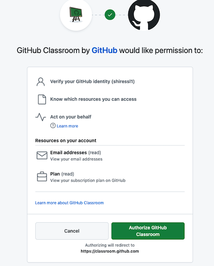
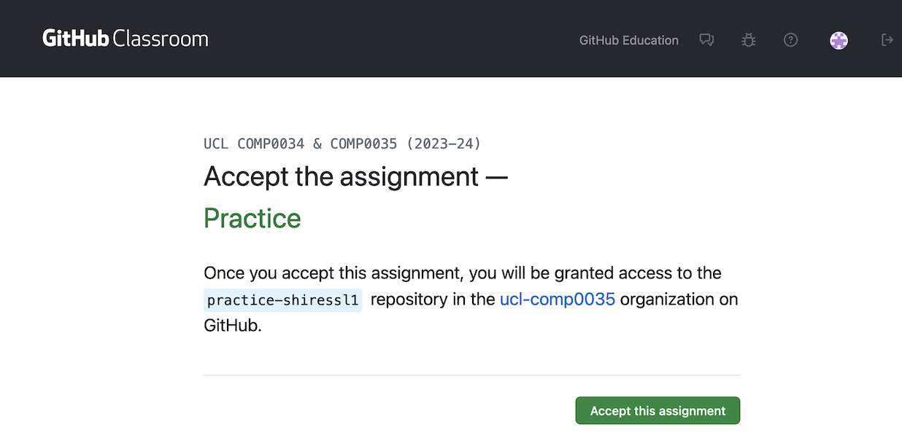
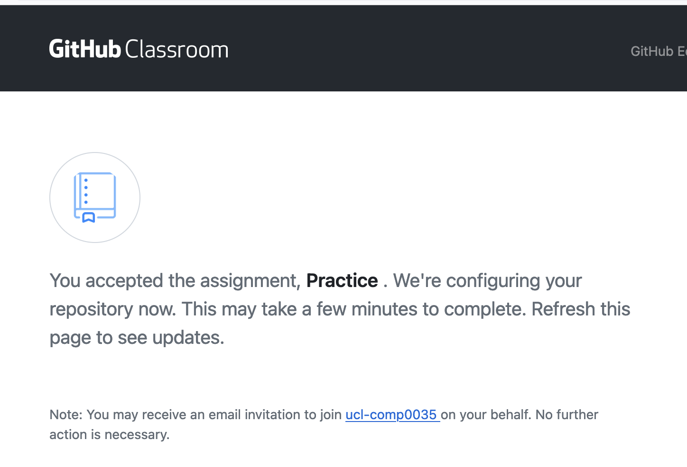
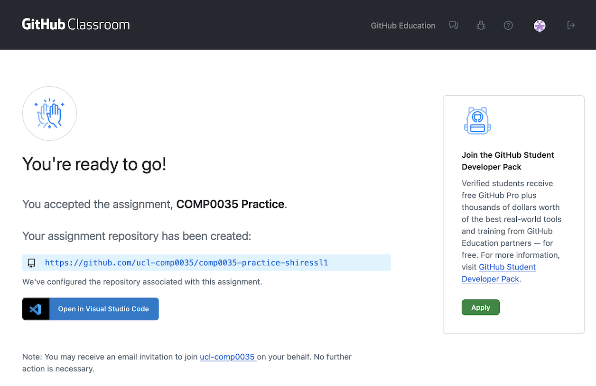
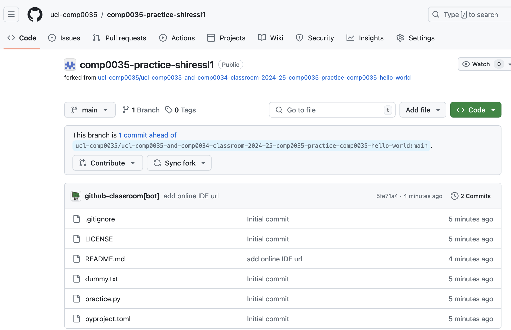

# Activity 2: Create a repository by accepting a GitHub Classroom assignment

GitHub Classroom provides a way for you to create repository so that it can then be accessed by yourself, the course
tutor and PGTAs.

You can directly access the classroom, though you don't need to do this as you will be given a link to the classroom
assignments when you need to use it.

All coursework repositories for COMP0034 and COMP0035 are created using GitHub Classroom.

You click on a URL that creates a copy of a template repository with some starter files that you will need for the
coursework.

Repositories that are created this way are stored in an organisation called **ucl-comp0035**, not in your personal
GitHub account. They are created as **private** which in this case means _you, the course tutor and PGTAs_ can see
your code; but not any other students.

### Instructions

1. Login to [GitHub](https://github.com/login)
2. After you log in, click on this practice GitHub classroom assignment
   link: [https://classroom.github.com/a/Y62rRhVm](https://classroom.github.com/a/Y62rRhVm)
3. The first time that you use GitHub classroom you need to:
    - authorise your GitHub account to use GitHub Classroom
    - join the organisation that owns the classroom, ucl-comp0035
    - If you see the following please authorise the classroom:

   

    - If you see the following then click on the green button to join the organisation:

   You should see something similar to the following:

   

4. Press ‘Accept this assignment’. 

   It may take a minute for the repository to be created, and you may need to refresh the browser page to see when it has finished.
   
   

   Once finished it will look something like this:

   

If you click on the link it should go to the newly created repository.

