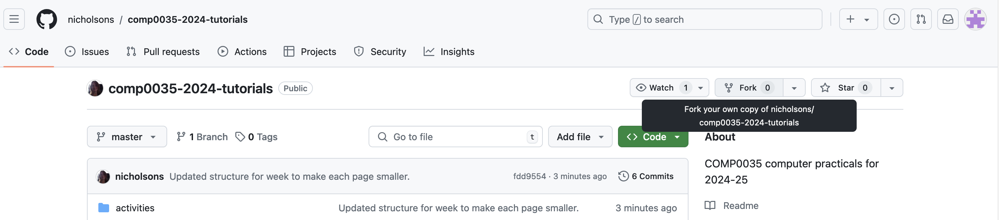

# Activity 3: Create a repository by forking a GitHub repository

In this activity, you will create a repository by forking a GitHub repository. This is the method you will use for the
tutorials (coding practicals).

A 'fork' is a copy of a repository. Forking a repository allows you to freely experiment with changes without affecting
the original project. You can fork a repository to propose changes to someone else's project or to use someone else's
project as a starting point for your own idea.

Go to the [ucl-comp0035/comp0035-practice]() repository.

1. Click on the 'Fork' button in the top right of the page.

    