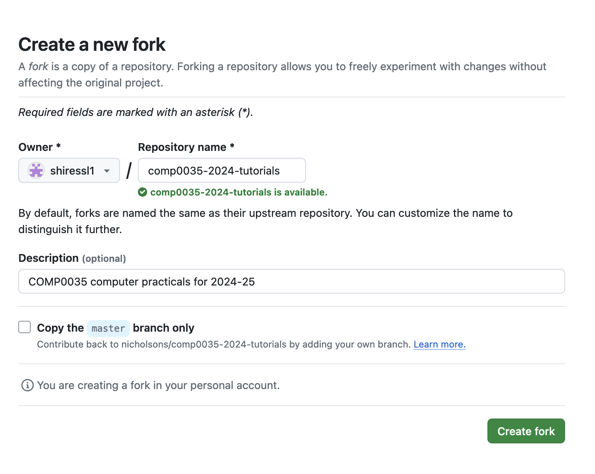
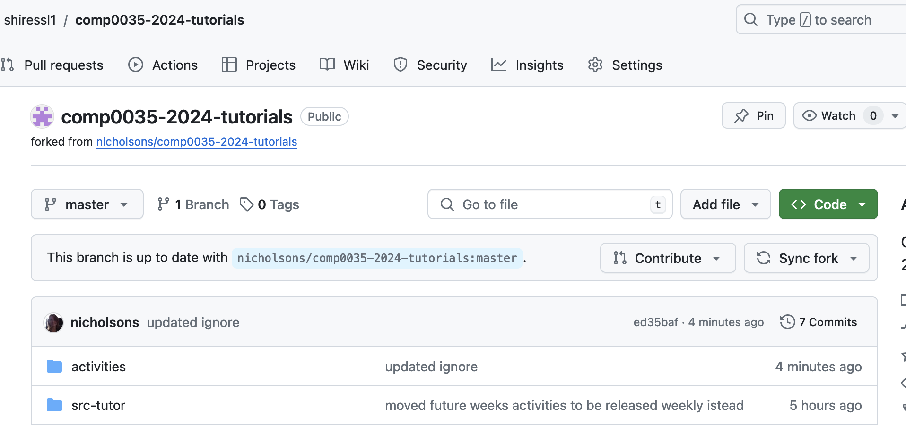

# Activity 3: Create a repository by forking a GitHub repository

In this activity, you will create a repository by forking a GitHub repository. This is the method you will use for the
tutorials (coding practicals).

A 'fork' is a copy of a repository. Forking a repository allows you to freely experiment with changes without affecting
the original project. You can fork a repository to propose changes to someone else's project or to use someone else's
project as a starting point for your own idea.

Go to the [nicholsons/comp0035-2024-tutorials](https://github.com/nicholsons/comp0035-2024-tutorials) repository.

1. Click on the 'Fork' button in the top right of the page.

   

2. Create a new fork. Untick the option to 'Copy the master branch only' and click 'Create fork'.

   

   You may see a temporary screen while the fork is created.

3. You will be taken to your new forked repository once created. The URL will be in the format
   `yourusername/comp0035-2024-tutorials`.

   

**IMPORTANT**: This repository will be updated weekly with new activities. You should pull these changes into your forked
repository to keep it up to date. Use the 'Sync fork' button.

If there have been changes, you will see a message showing the branch is out of date. Select the green 'Update branch' button.

