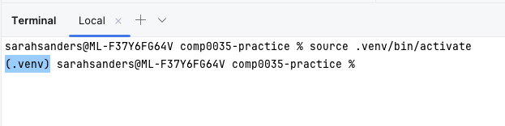
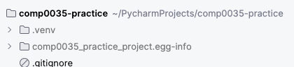

# Activity 7: Setting up a Python virtual environment in your IDE

As well as the code files in your project, you need a working Python environment to run the code.

You can use your base Python environment, but it is better to create a virtual environment for each project. This way
you can install the specific versions of libraries you need for the project without affecting other projects.

A fuller description and explanation of
a [virtual environment is available here](https://docs.python.org/3/library/venv.html#module-venv).

There are also a few typical project files that you need to be able to create and know the purposes of. These are also
covered in this activity:

- requirements.txt
- pyproject.toml
- README.md
- .gitignore

## Create and activate a virtual environment

You create the virtual environment directory within the project directory.

By convention, it is usually a directory named `env`, `venv`, `.venv` or `.env` in the root of the project directory.
The '.' denotes to the file system that it is a hidden folder.

You do not put the virtual environment in git/github. If you look in the .gitignore file in the 'practice' repository,
you will see that the .venv directory is already excluded from source code control.

You first create the virtual environment and then activate it. Once activated, the terminal will show the name of the
virtual environment in the prompt.



VS Code and Pycharm have built-in tools to create and manage virtual environments. See

- [VS Code Python environments](https://code.visualstudio.com/docs/python/environments)
- [PyCharm Python environments](https://www.jetbrains.com/help/pycharm/creating-virtual-environment.html)

You can also create a virtual environment from the command line using the Terminal tool window in either VS Code or
PyCharm.

In the Terminal window, enter the commands for your operating system that are
given [in this link](https://packaging.python.org/en/latest/guides/installing-using-pip-and-virtual-environments/#create-and-use-virtual-environments).

e.g for MaxOS and Unix:

```bash
python3 -m venv .venv
source .venv/bin/activate
```

e.g. for Windows:

```bash
py -m venv .venv
.venv\Scripts\activate
```

> ACTION: Create and activate a virtual environment for the 'practice' project.

## Configure the Python virtual environment

You will add packages to the virtual environment, and configure it to work with your own code in 'editable', or
development, mode.

### pip

`pip` is a Python tool for installing packages in Python environment. You can install one or more packages at once,
upgrade packages and delete them. Read more on [pip here](https://pip.pypa.io/en/stable/user_guide/).

You can find published Python packages on [the Python Package Index, PyPi](https://pypi.org)

`pip` is not the only tool used to manage Python packages. There are others such as `conda` and `poetry`. If you wish to
learn these instead of `pip`, then you are welcome to do so.

### requirements.txt

`requirements.txt` is a file that lists the additional libraries that are required for the project.

Since the virtual environment is not put in source code control, this file allows anyone to recreate with a virtual
environment with the packages you used.

You can install all the libraries in the virtual environment using the Terminal in your IDE and `pip` using the command:

```bash
pip install -r requirements.txt
```

You can update the requirements.txt file with new libraries or different versions by editing the file. You can specify
just the package name, or you can also include information about the version to use. The requirements
file format
is [documented here](https://pip.pypa.io/en/stable/reference/requirements-file-format/#requirements-file-format).

> ACTION: In your 'practice' project, use pip to install the libraries listed in the requirements.txt file.

### pyproject.toml

`pyproject.toml` is a file that is used to specify the build system requirements for the project to allow other
developers to build and run your code. It can be used to manage dependencies, instead of requirements.txt, however it
does more than 'requirements.txt' does.

For this course, you need to a way to install the code from your project in development or editable mode. To do this you
use a combination of `pip`, `setuptools` and `pyproject.toml`.

You will create a pyproject.toml file in the coursework project. there are many aspects that can be figured, a typical
minimum for the coursework is:

```toml
# Basic project information
[project]
name = "hello-world-sample-project"
version = "2024.0.0"

# Most students will use setuptools, though poetry is also an option
[build-system]
requires = ["setuptools >= 61.0"]
build-backend = "setuptools.build_meta"

# Setuptools configuration see https://setuptools.pypa.io/en/latest/userguide/pyproject_config.html#setuptools-specific-configuration
[tool.setuptools.packages.find]
where = ["src"]  # list of folders that contain the packages (["."] by default)
include = ["my_package*"]  # package names should match these glob patterns (["*"] by default)
exclude = ["my_package.tests*"]  # exclude packages matching these glob patterns (empty by default)
```

More on [pyproject.toml here](https://packaging.python.org/en/latest/guides/writing-pyproject-toml/).

Packages are likely to include specific guidance for pyproject.toml. Initially you many need to refer to
the [setuptools configuration](https://setuptools.pypa.io/en/latest/userguide/pyproject_config.html), and later in the
course [pytest configuation](https://docs.pytest.org/en/6.2.x/customize.html#pyproject-toml).

To use pyproject.toml to install your code in 'editable', or development, mode use the Terminal window and enter
the command:

```bash
pip install -e .
```

Note that the '.' at the end of the command is the path to the directory containing the pyproject.toml file; in this
case in the root of the project.

> ACTION: use the `pip install -e .` command in the Terminal window of the 'practice' project.

You should see a new hidden folder (`.egg-info`) is created that has information about the installed project:



## Exclude files from being tracked in your git repository using .gitignore

A `.gitignore` file is used to tell Git (the underlying version control software that GitHub uses) which files should
not be tracked in the repository.

For example, you don’t want to track configuration files that are specific to the code
editor or IDE (e.g. VS Code), particularly when collaborating with others in a repo, as each person is likely to have a
different local config (Windows v. Mac, file locations etc.). If you don’t exclude these files from GitHub, then you may
unintentionally cause problems for each other by overwriting each other’s IDE configuration when you commit and push
changes to the repo. You also don’t want to track common python files such as the virtual environment for your project.

In the two repositories you created earlier, the `.gitignore` was added directly in GitHub. You can also create it in
your IDE, PyCharm and VS Code have plugins that you can add that will make it easier to create a .gitgnore file from
templates.

- [VS Code .gitignore extensions](https://code.visualstudio.com/docs/editor/versioncontrol#_scm-provider-extensions)
- [Pycharm create .gitignore](https://www.jetbrains.com/help/pycharm/set-up-a-git-repository.html#ignore-files) or a
  third party plugin such as [.ignore](https://plugins.jetbrains.com/plugin/7495--ignore).

## Provide a README.md as a guide to developers using your source code repository

`README.md` tells other developers important information about your repo such as what the repo contains, any set-up
instructions etc. You need to edit this for your coursework to explain to the markers anything they need to know to
set up and run your code.

`.md` means it is a Markdown format file. Markdown is widely used for documentation of code. It is not difficult to
learn, you just need a few basic syntax rules. Refer to
the [GitHub markdown guide](https://docs.github.com/en/get-started/writing-on-github/getting-started-with-writing-and-formatting-on-github/basic-writing-and-formatting-syntax).

1. Navigate to README.md file in the 'practice' project and open it.
2. Make some changes, e.g.:

    - Change the first level heading from "comp0035-practice" to "Practice".
    - Add a second level heading e.g. "Introduction"
    - Add a line of text e.g. "This repository is for learning to use GitHub"

   ```markdown
   # A level 1 heading

   ## A level 2 heading

   Some text
   ```
3. Save the file.
