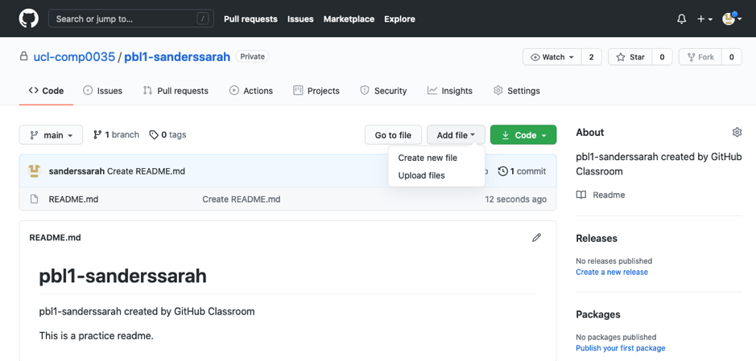
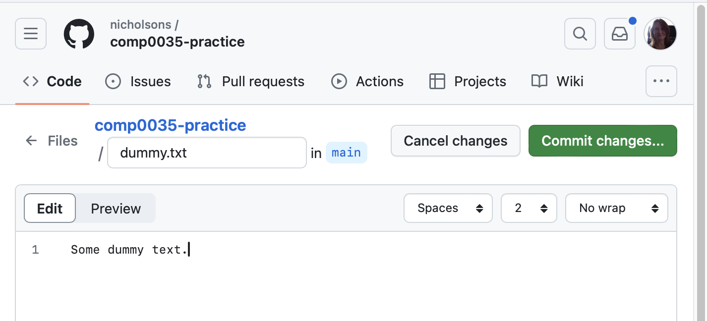
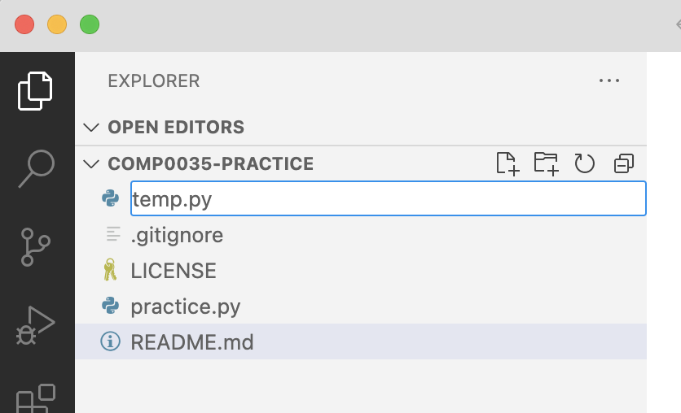
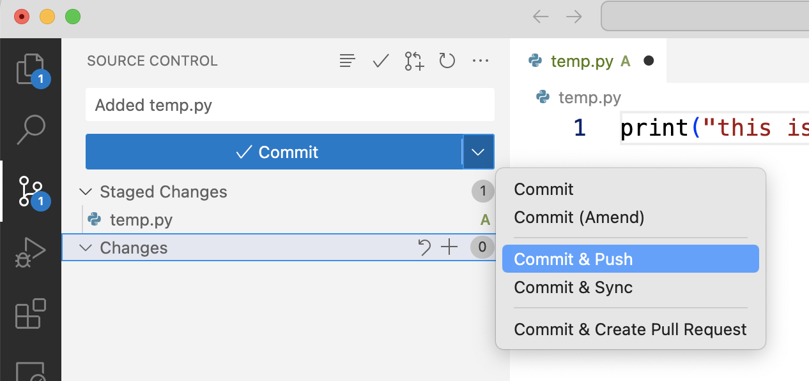
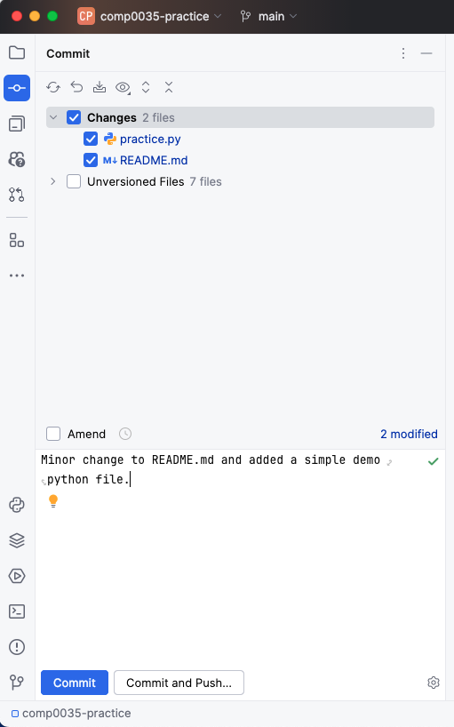
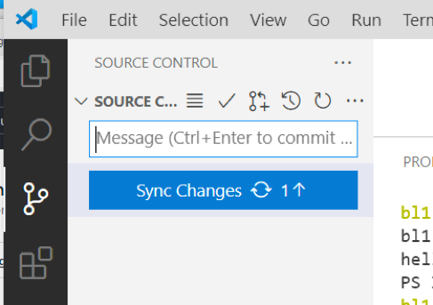
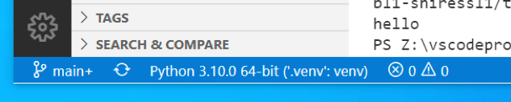
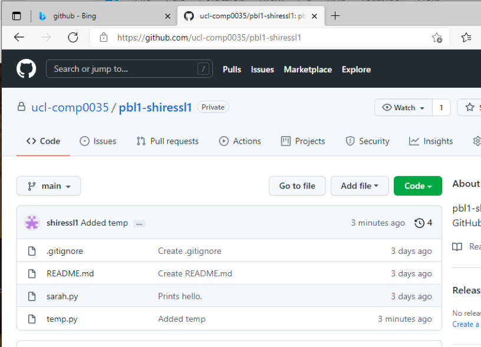

# Activity 8: Synchronise changes between the local reposository in your IDE and the remote repository on GitHub

Currently, you have a **local** copy (clone) of the remote master repository (on GitHub).

To get the changes from README.md from local to the remote you will need to **commit** the changes and **push** the
changes to the remote.

If changes have been made in the remote repository, you will also need to **pull** the changes from the remote to the
local. You will add a file directly to GitHub so that you can experience this.

## Create a file directly in GitHub

Go to GitHub on the browser and find the practice repository you created in the previous activities.

Find the `Add file` dropdown and select `Create new file`.



Name the file `dummy.txt` and add some text to the file. Then select 'Commit changes...' to save the file and commit the
changes.

As you are working directly in GitHub.com you only need to Commit to save the file, you do not need to 'push' the
changes.



Switch back to your IDE.

## Create a file in your IDE

1. Create a Python file in your IDE. There are different ways to do this (e.g. File > New).
   In VS Code the following used the icon (a page with a + symbol) below and entered the filename as `temp.py`:

   

   In PyCharm create a Python file (e.g. File > New) and give it a
   name. [Add Python code to the file](https://www.jetbrains.com/help/pycharm/creating-and-running-your-first-python-project.html#edit-file)

2. Add a line of code to the file, e.g.
   ```python
   if __name__ == '__main__':
       print('Hello, World!')
   ```

    - [VS Code editing code](https://code.visualstudio.com/docs/python/editing).
    - [PyCharm edit code](https://www.jetbrains.com/help/pycharm/creating-and-running-your-first-python-project.html#edit-file)

3. Save the file.

Extra challenge: you should have a working virtual environment set up in your IDE. This will allow you to run the Python
file. Find the instructions for running code in your IDE. Both IDEs have a green arrow/play icon that runs the code, or
go a Terminal window in the IDE and use python e.g. `python3 temp.py`

## Add the file to be tracked by source code control

When you create a new file, git needs to know if you want to track it. To do this you 'Add' the file to the source code
control.

1. To add the file to be tracked by source code:
    - [PyCharm](https://www.jetbrains.com/help/pycharm/adding-files-to-version-control.html)
    - VSCode: Find the source code control icon in the left menu bar and expand the **Changes** section

   

   Add the file to be tracked select the **+** symbol next from the icons to the right of the file name which will
   stage the changes (this _adds_ the file and starts the commit step).

## Commit the changes

A commit records changes to one or more files in your repository.
Git assigns each commit a unique ID that identifies: The specific changes. When the changes were made. Who created the
changes.

You should have 2 changed files, the README.md and the new Python file. You will create a commit that includes both.

It is customary to add a commit message to explain the changes you have made.

VS Code: Add a commit message (see the Message box under the Source Control heading in the image below) and press the
dropdown arrow at the edge of the blue 'Commit' button and select 'Commit'. As shown, you can combine commit with 'Commit & Push' to commit and push the file, or 'Commit & Sync' which will also pull changes from GitHub. For now, choose just Commit.



PyCharm: Go to the Commit icon on the left menu bar. Tick the files you want to include in the commit, add a commit
message, then press Commit.



#### Pull changes from GitHub, and then Push commited changes to GitHub

The first step is to `pull` any changes that are in GitHub before you push your committed changes. For example, you may
have
edited a file directly in GitHub, or someone else may have pushed a recent change to your GitHub repository.

You _pull_ the commit from GitHub (the dummy.txt that you added) to the local repository in the IDE; and then _push_ the
commit (README.md and temp.py) you made to the local repository to the remote repository on GitHub.

- [PyCharm pull changes](https://www.jetbrains.com/help/pycharm/sync-with-a-remote-repository.html#pull)
  and [PyCharm push changes](https://www.jetbrains.com/help/pycharm/commit-and-push-changes.html#push)
- [VS Code push and pull remote changes](https://code.visualstudio.com/docs/sourcecontrol/intro-to-git#_pushing-and-pulling-remote-changes)

There are also options in the IDEs to 'synchronise' changes which carries out both pull and push. For example, in VS
Code:

> 
> Synchronise is also available using the circular arrow icon show in the bottom left of the image below:
> 

In your IDE, you should now see the 'dummy.txt' file in your local repository.

Look in GitHub. You should now see the changes to README.md and temp.py in GitHub with your commit message (e.g. 'Added
temp' in the image below):



## Error: 'You need to set your username and email'

In previous years, some students got an error message warning that you need to set your username and email. If this
happens, [follow the instructions here](https://docs.github.com/en/get-started/getting-started-with-git/setting-your-username-in-git)
