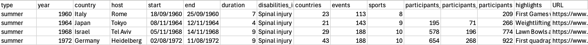

# Activity 2.1: Use pandas to open .csv and .xlsx files and create a DataFrame

## Read: Data

The data in the activities is from the following
source: [Paralympic medals and event info](https://www.paralympic.org/london-2012/results/medalstandings)

The data is saved in the `paralympics_raw.csv` file. The data has been modified such that it can be used for a
data cleaning activity.

## Activity: Structuring code in packages, modules and functions

As per the introduction, try and write the code in a way that makes it potentially re-usable in an application. It is
not necessary to do this to make the code run, but will be marked in the coursework so start working that way now.

1. Create yourself a new Python module for the data preparation in the `src` directory. You could even create a new
   package as well if you wish.
2. Add an import for `pathlib` and `pandas` to the module. Pandas by convention is imported using the syntax
   `import pandas as pd`.
3. Create the structure for a Python function in the module. This function will take a pandas DataFrame as a parameter
   and print information that describes the data in the DataFrame.
4. Stretch: Add a docstring to the function. The following is a general format for a multi-line docstring; specific
   styles include [Google](https://github.com/google/styleguide/blob/gh-pages/pyguide.md#38-comments-and-docstrings),
   reStructuredText (reST), Numpydoc, Epytext, and more.
   ```python
   def some_function(argument1):
        """Summary or Description of the Function
    
           Parameters:
           argument1 (int): Description of arg1
    
           Returns:
           int:Returning value
    
        """
    ```
5. Add a 'main' section to the code file (`if __name__ == '__main__':`).

## Read: Pandas DataFrame overview

You will by now have seen spreadsheets that contain data in rows and columns, where the columns represent variables and
the rows the values of those variables for a particular instance.

The paralympics data for example has data in rows with variables names in columns:



The values in the data can be a mix of data types: integers, text, dates etc.

DataFrames in the Python pandas library are similar. They are two-dimensional labeled data structures that can contain
different data types.

The pandas library has many functions for analysing, cleaning, exploring and manipulating data. Pandas works with
one-dimensional data array using pandas Series, and with two-dimensional data using the pandas DataFrame. Each of these
has functions. You will mostly be using Pandas DataFrame since the data is two-dimensional.

You can create a pandas DataFrame in a number of ways, in this course you will typically create it by reading data that
is stored in a `.csv` or `.xlsx` file so this is the method used in this tutorial. For other ways to create a DataFrame
please refer to the [pandas documentation](https://pandas.pydata.org/docs/reference/api/pandas.DataFrame.html).

## Activity: Read .csv and .xlsx into a DataFrame

There are two data files in the `src/tutorialpkg/data/` directory:
   - [paralympics_events_raw.csv - a .csv file with data about paralympic events](../../src/tutorialpkg/data/paralympics_events_raw.csv)
   -  [paralympics_all_raw.xlsx - an Excel file with 2 worksheets, the first with the data about paralympic events, the second with the medal tables of the competing teams](../../src/tutorialpkg/data/paralympics_all_raw.xlsx)

You will need to use a different Pandas function for each type of file:

- [pandas.read_csv](https://pandas.pydata.org/docs/reference/api/pandas.read_csv.html) for csv files
- [pandas.read_excel](https://pandas.pydata.org/docs/reference/api/pandas.read_excel.html) for xlsx files

There are many options you can apply on reading a file into a pandas dataframe such as selecting certain columns to
import, setting data types for columns, etc. Use the above linked references for details of these.

1. Add code to create a Python variable with the data file location (file path). The data file is in
   `data\paralympics_events_raw.csv`.
2. Add code to the 'main' to read all the contents of the file `data/paralympics_events_raw.csv` into a pandas
   DataFrame.
3. Add code to the 'main' to read all the contents of the worksheet of the file  `data/paralympics_all_raw.xlsx` into
   a pandas Dataframe.
4. The Excel file has two worksheets, by default `read_excel` will open the first worksheet. You can change this by
   specifying the worksheet e.g. `pd.read_csv(paralympics_datafile_excel, sheetname=1)` will read the second worksheet (
   counts from 0), `pd.read_csv(paralympics_datafile_excel, sheetname="name_of_sheet")` to read a sheet called '
   name_of_sheet'. Add code to create a 3rd dataframe that contains the data from the second worksheet (called '
   medal_standings').
5. Run the code. It won't return anything is all is well. If you have errors, read the error messages to try and
   identify what is wrong and correct your code. Some common issues:

   `FileNotFoundError: [Errno 2] No such file or directory: '.../src/tutorialpkg/paralympics_events_raw.csv'` - in this
   case the `/data/` directory is missing from the filepath

   ```text
     Traceback (most recent call last):
        File ".../src/tutorialpkg/data_prep/analyse_dataframe.py", line 55, in <module>
        paralympics_excel_df = pd.read_csv(paralympics_datafile_excel)
                               ^^^^^^^^^^^^^^^^^^^^^^^^^^^^^^^^^^^^^^^
     <lines omitted here for brevity> 
     UnicodeDecodeError: 'utf-8' codec can't decode byte 0xde in position 16: invalid continuation byte
   ``` 
   This one is more tricky to detect as the issue is that `read_csv` has been used for a file that is an Excel data file
   instead of `read_excel`

   `ImportError: Missing optional dependency 'openpyxl'.  Use pip or conda to install openpyxl.` - you forgot to install
   openpyxl which is needed to read an Excel file. Install it in the virtual environment using `pip install openpyxl`
6. Optional stretch: Add error handing to the filepath


[Go to activity 2.3](2-3-pandas-describe.md)