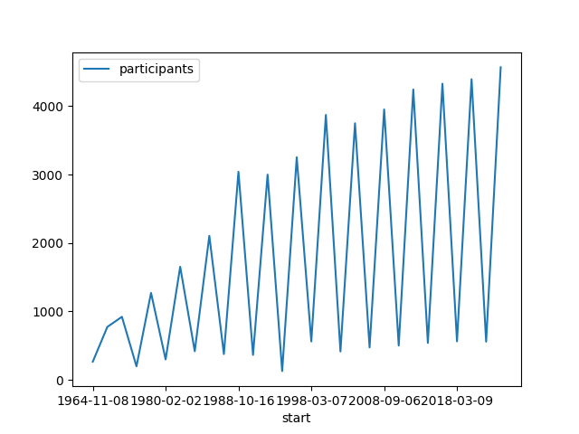

# Timeseries data

The previous activities considered the use of boxplots and histograms to visualise the distribution of the data.

This example uses a line chart. Line charts are useful for showing "patterns over
time". [Source: Depict](https://depictdatastudio.com/charts/line/). See
also [The Data Visualisation Catalogue](https://datavizcatalogue.com/methods/line_graph.html).

In a line plot, the x-axis usually represents the time, and the y-axis represents the variable(s) being measured.

The next charts consider the number of participants over time.

1. Create a new function to plot timeseries. Add code to create and show
   a [plot](https://pandas.pydata.org/docs/reference/api/pandas.DataFrame.plot.html) where `x="start"`
   and `y="participants"`.

   The distribution looks like this:
   

   Winter events have far fewer participants than summer, hence the zigzag effect.

2. Modify the chart code above to group the data by the `type` column before creating the plot. The general syntax
   is: `df.groupby("ColNameToGroupBy").plot(x="SomeCol", y="AnotherCol")`.

If you wish to challenge yourself, display the charts showing the split of male and female participants.

You should be able to see from the charts that there appears to be an unusual dip in Winter 1994 Paralympics which may
need further investigation.

[Next activity](3-6-lint)