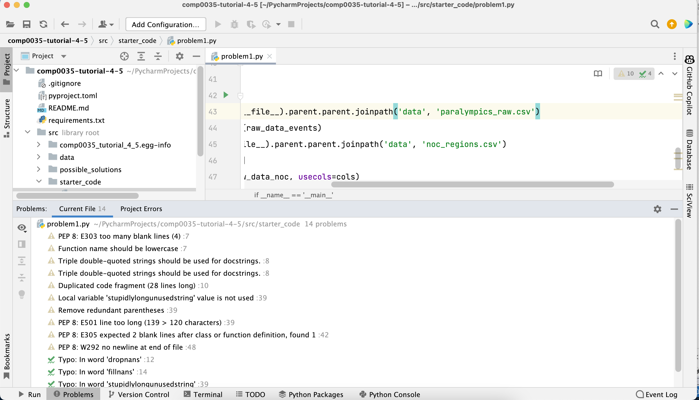
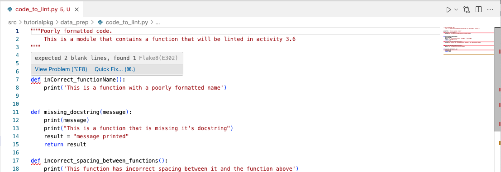

# Using linters to check your code style

Linting in Python refers to the process of running a program that analyzes your code for potential errors, stylistic
issues, and bugs. It's a little like having a spelling and grammar checker for your code.

Python styles are documented in standards. The main style guide is [PEP8](https://peps.python.org/pep-0008/); though
there are others such as [PEP257 for docstrings](https://peps.python.org/pep-0257/). Adhering to standards helps you and
others to read your code.

Using a linter can save you time and headaches by catching issues early in the development process.

Linters are Python packages. The PyCharm IDE by default includes a linter. For the VS Code IDE you need to install
linter.

Popular Python linters include [Pylint](), [Flake8], and [Black](https://black.readthedocs.io/en/stable/). Each has its
own set of rules and configurations.

Some of the things that linters can help with:

- **Error Detection**: Linters can catch syntax errors, undefined variables, and other common mistakes.
- **Code Style**: They help ensure your code adheres to a consistent style guide (e.g. PEP8), making it more readable
  and maintainable.
- **Best Practices**: Linters can suggest improvements based on best practices, such as avoiding certain patterns that
  might lead to bugs or performance issues.

This activity is a quick introduction. Linting is covered again later in the course.

## Finding issues using a linter

1. Install two linters in your virtual environment: `pip install flake8 pylint`
2. Lint the file in [`tutorialpkg/code_to_lint.py`](../../src/tutorialpkg/code_to_lint.py) with flake8:
   `flake8 src/tutorialpkg/code_to_lint.py`
3. Lint the same file using pylint: `pylint src/tutorialpkg/code_to_lint.py`
4. Note that the two linters report slightly different issues

The purpose of using is a linter is to identify the issues. The benefit however is only achieved once you fix the
identified issues. Running a linter is the easy part, the challenge is to then fix the identified issues.

## Fixing issues

There are packages that will autoformat your code such as 'black' and 'autopep8' that you
may wish to explore. Be warned, black is opinionated and may make changes you don't want it to; you may prefer to
correct issues yourself.

PyCharm has options that will correct your code. If you are using PyCharm, try opening the code_to_lint.py and go to the
menu option 'Code | Format Code' and it should correct the spacing, line break and any indentation issues.

Both PyCharm and VS Code, particularly when you combine them with Copilot, will warn of style issues and offer
solutions.

Typically, where you see an error (by default a red squiggly underline in VS Code, or highlighted code in PyCharm, or a
lightbulb symbol); then the IDE will help you to fix it. Usually, clicking on the lightbulb will tell you what is wrong
and if possible, offer to fix it for you.

You will need to refer to the documentation for your IDE to work out how to identify warnings and use linting:

- [VS Code linting](https://code.visualstudio.com/docs/python/linting)
- [VS Code identify warnings](https://code.visualstudio.com/Docs/editor/editingevolved#_errors-warnings)
- [PyCharm Python code inspections](https://www.jetbrains.com/help/pycharm/running-inspections.html)
- [PyCharm fix problems](https://www.jetbrains.com/help/pycharm/resolving-problems.html)

Example of PyCharm style warnings, click on the warning triangle in the upper right of the code pane:

Example of VS Code style warning, hover over the squiggle to see the options:

NB: In VS Code, the warnings will not disappear as soon as you correct the code, you need to save the changes. The
linter appears to run only on save.

