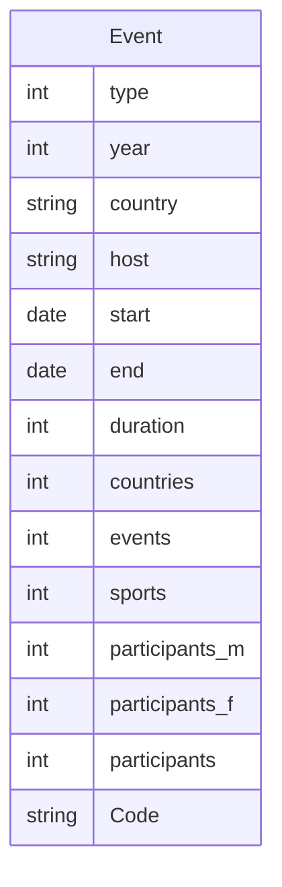
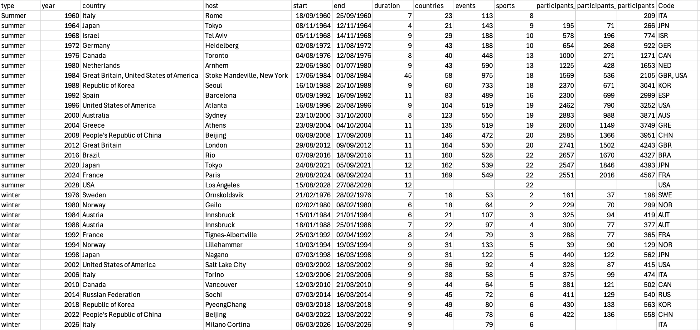
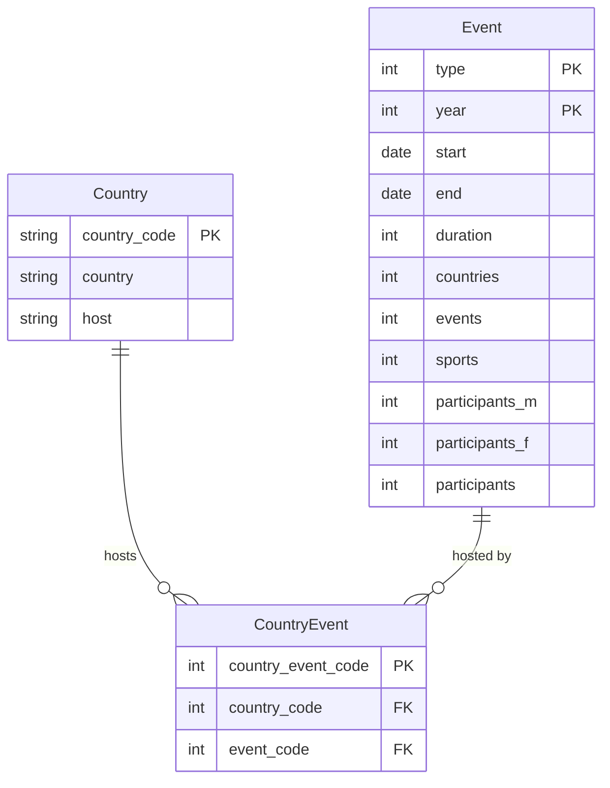

# Design and draw an Entity Relationship Diagram (ERD) for a database normalised to 3rd normal form (3NF)

In this activity you will develop an ERD for the `paralympics_events_prepared.xlsx` data file.

If you wish to view the mermaid code in this file as diagrams in your IDE, you will need
to [install the Mermaid plugin for your IDE](https://mermaid.js.org/intro/getting-started.html#_3-using-mermaid-plugins).

## Step 1 List the attributes

The columns and datatypes in the .xlsx file can be found using the code in [get_cols_dtypes.py]() which returns:

```text
type                      object
year                       int64
country                   object
host                      object
start             datetime64[ns]
end               datetime64[ns]
duration                   int64
countries                  int64
events                     int64
sports                     int64
participants_m             int64
participants_f             int64
participants               int64
Code                      object
```

A description these attributes:

'type': Type of Paralympics (summer or winter)
'year': Year of the event
'country': Country where the event was held
'host': Host city
'start': Start date of the event
'end': End date of the event
'duration': Duration of the event in days
'countries': Number of participating countries
'events': Number of events within the event (e.g. Women's 400m Freestyle - S9, Men's 100m Butterfly - S14, etc.)
'sports': Number of sports included in the event
'participants_m': Number of male participants
'participants_f': Number of female participants
'participants': Total number of participants
'Code': National Paralympic Committee (NPC) code for the competing team (country or construct)

## List potential entities

The data lists details about paralympic events. 'Event' is an entity.

Start with this. There may be are others, e.g. 'country', that you identify later.

An un-normalised ERD representation of the event entity and its attributes can be drawn as follows. You include the
attribute name and the data type:



## First normal form (1NF)

First Normal Form (1NF) is a fundamental concept in database design, aimed at ensuring that the data is stored in a
structured and efficient manner. A table is in 1NF if the intersection of every column and record contains only one
value.

The key aspects of 1NF are:

- **Atomicity**: Every column contains only atomic (indivisible) values. This means that each field contains a single
  value,
  not a set of values or a list.
- **Uniqueness**: Each column must have a unique name.
- **No Repeating Groups**: There should be no repeating groups or arrays. Each row must be unique and identifiable by a
  **primary key**.

A **primary key (PK)** is an attribute (column) containing unique values so it can be used to uniquely identify a given
row.

A **composite primary key** is where to a combination of two or more columns are used to uniquely identify a row.

Review the contents of the table against the above checklist. Note any issues as these will need to be addressed.



&#x274C; Atomicity. Fail. If you look at the data shown in the image above, the row for 'summer 1984' contains lists as
the event was held in two locations.

&#x2705; Uniqueness. Pass. Each column has a unique name.

&#x2705; No Repeating Groups: Pass. A row could be uniquely identified by a combination of the 'type' and 'year'
attributes (if the New York/Stoke Mandeville event were split into two rows). When two or more attributes uniquely
identify a row, this is called a **composite primary key**.

**Action required**:

The row for Stoke Mandeville and New York has lists in 'country', 'host' and 'Code'.

One solution would be to split the data into two rows, one for Stoke Mandeville and one for New York. This is
problematic as you do not have separate data on the events, participants, countries etc. for the two separate elements
of the event.

Instead, you can create a new table to store the lists of values for 'Code, host and country', call it 'Country'.

The relationship between the Event and Host could be described as: "A country hosts one or many events. An event can be
hosted by one or many countries (NY/StokeMandeville)".

A relational database does not support the many-to-many relationship so you need to add another table that 'joins' or
links the Event to the Country.

The ERD now looks like this:



**Action**: Work this out yourself!

Look at the data again after the step above. A country may host events that are in different host cities, 
the problem of 'atomicity' has not been fully resolved as you now have a list of values in the 'host' column of the 
Country table.

Re-draw the tables to reflect the relationships:

- An Event may have one or more Host cities; a Host city may host one or more events
- A Country many have one of more Host cities; a Host city may only be in one country

## Second normal form (2NF)

Second normal form (2NF) is when a table that is already in 1NF and in which the values in each non-primary-key
attribute (column) can be worked out from the values in all the attributes (columns) that make up the primary key.

To determine 2NF you should be aware of the term **functional dependency**.

A **functional dependency** is a property of the meaning of the columns in a table and indicates how columns relate to
one another. A functional dependency exists when one attribute (or a set of attributes) uniquely determines another
attribute. In other words, if you know the value of one attribute, you can determine the value of another attribute.
There is a formal notation for this which we will not use in this course.

For tables with a single-column primary key, 2NF is automatically satisfied if the table is in 1NF. This is because
there can’t be partial dependencies when there’s only one column in the primary key.

The key aspects of 2NF are:

- 1NF is met
- No partial dependencies, where a non-key attribute is dependent on only a part of a composite primary key.
  Every non-key attribute must depend on the entire primary key, not just a part of it.

Consider a table storing information about courses and the instructors who teach them:

| CourseID | InstructorID | InstructorName | CourseName |
|:--------:|:------------:|:--------------:|:----------:|
|   101    |      	1      |     Smith      |    Math    |
|   102    |      	2      |    Johnson     |  Science   |
|   103    |      	1      |     Smith      |  Algebra   |

In this table, CourseID and InstructorID together form the composite primary key.

InstructorName depends only on InstructorID, not on the combination of CourseID and InstructorID.

To convert this table to 2NF, we need to remove the partial dependency by creating two separate tables:

Courses Table:

| CourseID | CourseName |
|:---------|:-----------|
| 101      | Math       |
| 102      | Science    |
| 103      | Algebra    |

Instructors Table:

| InstructorID | InstructorName |
|:-------------|:---------------|
| 1            | Smith          |
| 2            | Johnson        |

Now, each non-key attribute is fully dependent on the primary key of its respective table, satisfying 2NF.

**Action**: The tables in the paralympics ERD already satisfy 2NF. However, you could add a new column to the
Event table that has unique values to act as the primary key. An auto-increasing integer starting from 1 is a common 
unique identifier.

## Third normal form (3NF)

Third normal form (3NF) is a table that is already in 1NF and 2NF, and in which the values in all non-primary-key
columns can be worked out from only the primary key column(s) and no other columns.

The key aspects of 3NF are:

- It is in Second Normal Form (2NF)
- No Transitive Dependencies: All non-prime attributes (attributes that are not part of any candidate key) must be
  directly dependent on the primary key. There should be no transitive dependency, where a non-prime attribute depends
  on another non-prime attribute.

Consider this table:

| StudentID (PK)	 | CourseID (PK)	 | InstructorID	 | InstructorName |
|:----------------|:---------------|:--------------|:---------------|
| 1	              | 101	           | 1	            | Smith          |
| 2	              | 102	           | 2	            | Johnson        |
| 3	              | 103	           | 1	            | Smith          |

StudentID and CourseID together form the composite primary key.

InstructorName is dependent on InstructorID, not directly on the composite key.

To convert this table to 3NF, we need to remove the transitive dependency by creating separate tables:

StudentsCourses Table:

| StudentID (PK)	 | CourseID (PK)	 | InstructorID	 |
|:----------------|:---------------|:--------------|
| 1	              | 101	           | 1	            | 
| 2	              | 102	           | 2	            | 
| 3	              | 103	           | 1	            |

Instructors Table:

| InstructorID	(PK) | InstructorName |
|:------------------|:---------------|
| 1	                | Smith          |
| 2	                | Johnson        |
| 1	                | Smith          |

Each non-primary attribute is directly dependent on the primary key of its respective table and so satisfies 3NF.

**Action**: Try yourself to identify the changes that could be made to the Event table to achieve 3NF.

First identify the potential functional dependencies. Note that there is no single answer to this, the following are
some of the potential dependencies identified in the original host table. You already dealt with Host and Country at the
1NF stage:

- PK dependencies:  event_code -> all other attributes
- Country code dependencies: Code -> country or country -> Code
- Date dependencies:  start, end -> duration
- Participant dependencies:  participants_m, participants_f → participants
- Event details:  year, type → country, host, start, end, duration, countries, events, sports, participants_m,
  participants_f, participants, Code
- Host dependencies:  host -> country

Consider the options above and decide which tables to split the data into.

For practice, try and identify at least 2 more tables using the suggested functional dependencies and draw the new ERD.

[Next activity](4-3-ERD-part2.md)
