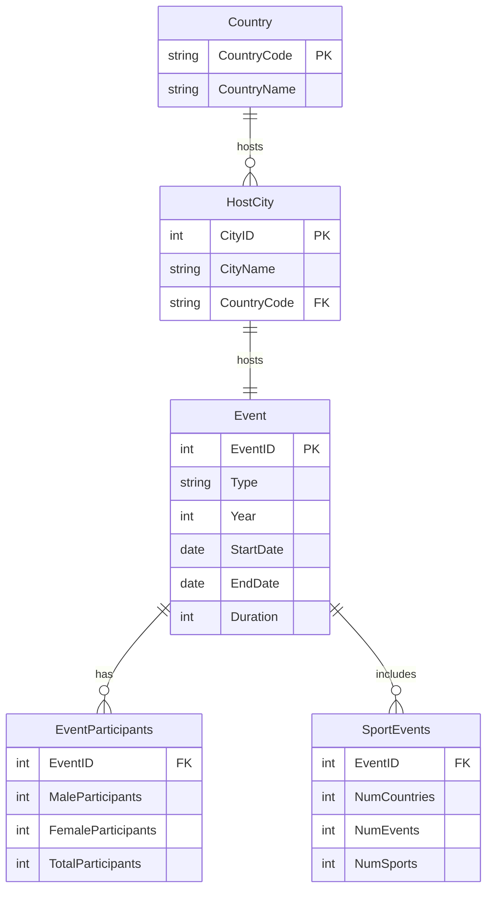
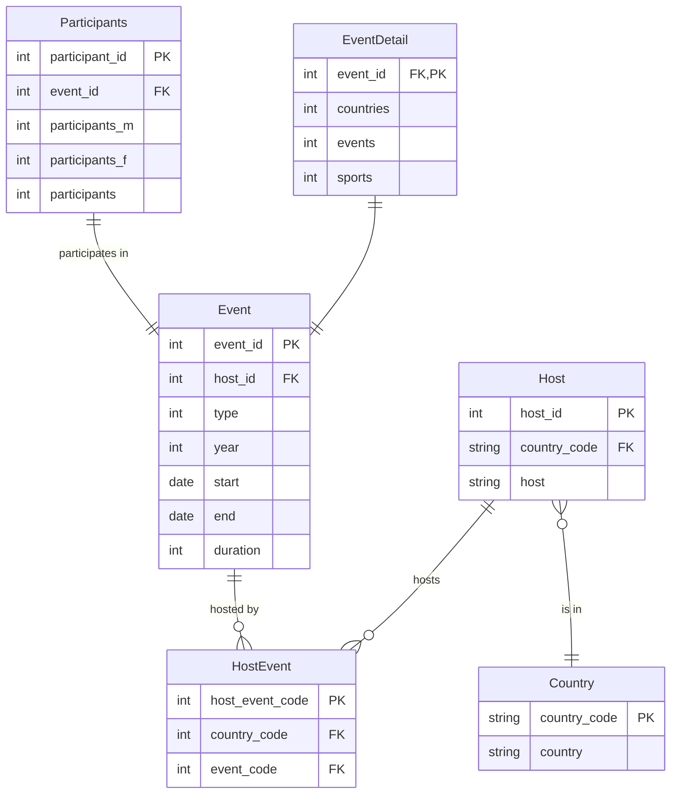

# 3. ERD solution

This is the solution generated by Mermaid GPT. Do you agree with this, does it address the needs of the data? Is your
ERD different?

This is a solution based on the text in the previous activity. Note that:

- the 'Participant' and 'EventDetail' tables are not strictly necessary but included based on the last activity that
  asked you to add 2 further possible tables
- the 'Participant' and 'EventDetail' table rows can be uniquely identified by the 'event_id' which can act as both PK
  and FK, or you could choose to add another field to act as the PK as is shown in the 'Participants' table

[Next activity](4-4-constraints.md)
