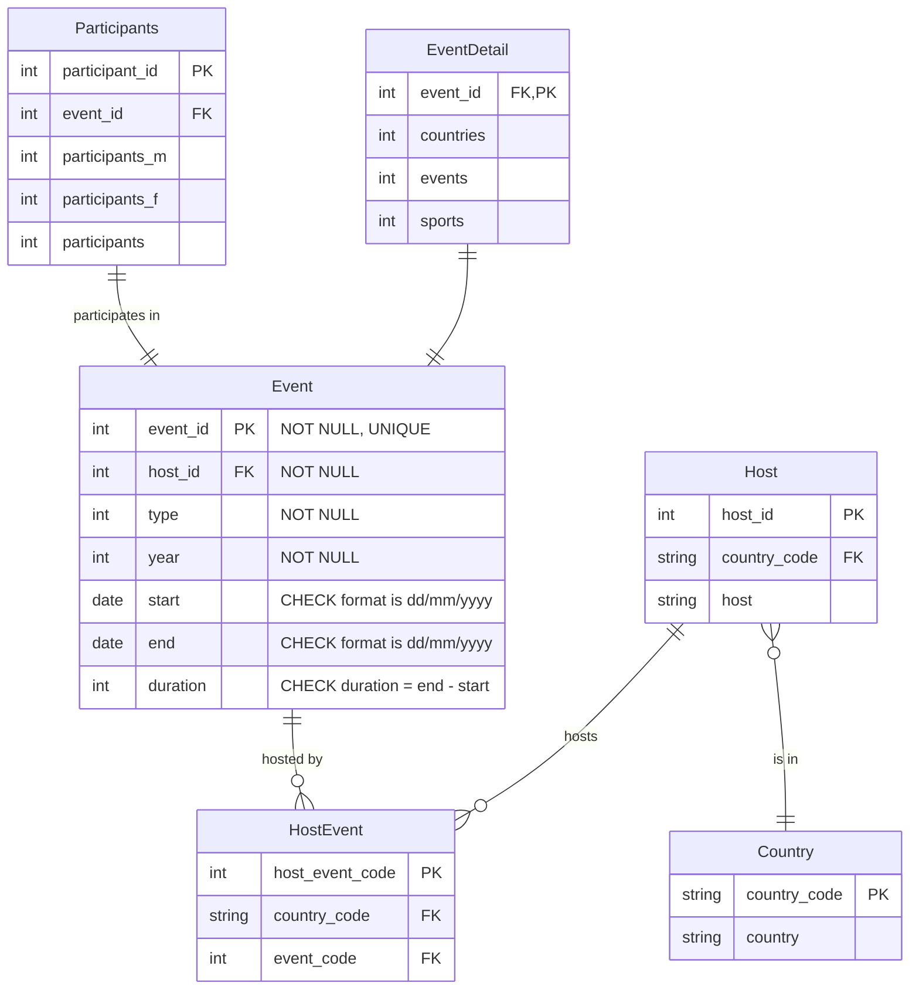
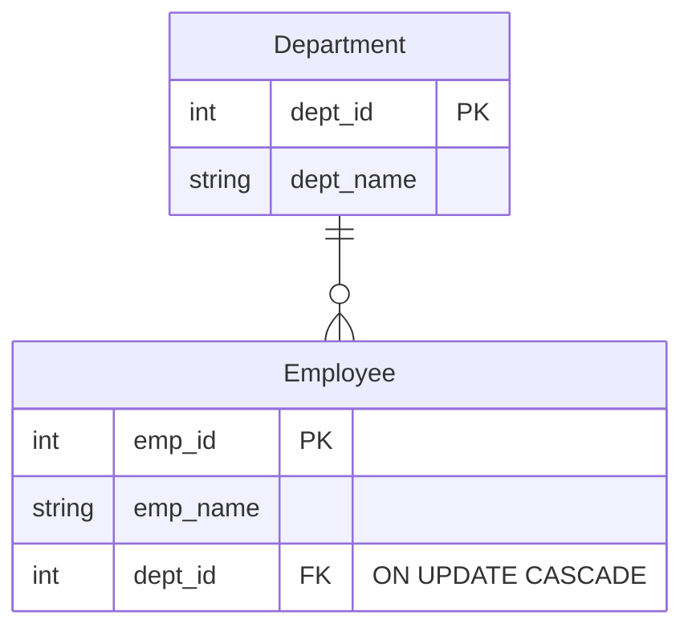
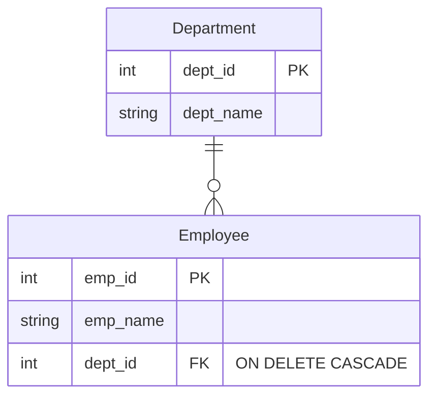

# Data constraints and on delete and update actions

Now that you have a design of the tables, you need to clarify any constraints on the data.

For tables that have relationships, you also need to decide what to do when the row in one of the tables is updated or
deleted.

## Data constraints

The following are some of the common constraints that can be noted for an attribute in a SQL database.

You have already seen the first two of these in the previous activities.

- PRIMARY KEY: A combination of NOT NULL and UNIQUE. Uniquely identifies each row in a table.
- FOREIGN KEY: Ensures that values in a column (or a group of columns) match values in another table’s column(s),
  maintaining referential integrity.
- CHECK: Ensures that all values in a column satisfy a specific condition.
- DEFAULT: Sets a default value for a column if no value is specified.
- NOT NULL: Ensures that a column cannot have a NULL value.
- UNIQUE: Ensures that all values in a column are different. This is required for a single PK field!

**Action**: Consider the data for the paralympics below and determine the constraints for the values in each column.

**Action**: Add the constraints to the ERD. The event table is done for you.

## ON UPDATE and ON DELETE actions

In relational databases, update constraints help maintain data integrity when changes occur.

If you do not specify a constraint then defaults will be applied. If an action is not explicitly specified, it defaults
to "NO ACTION".

The constraints to consider are:

### Update constraints

| Constraint            | Action                                                                                                                                                                                                                                                                                                                                                                                                                            |
|:----------------------|:----------------------------------------------------------------------------------------------------------------------------------------------------------------------------------------------------------------------------------------------------------------------------------------------------------------------------------------------------------------------------------------------------------------------------------|
| ON UPDATE CASCADE     | Ensures that when a value in the parent table (the table being referenced) is updated, all corresponding values in the child table (the table with the foreign key) are automatically updated to match the new value. This is useful in scenarios where the primary key of a parent table might change, and you want to ensure that all related records in the child table reflect this change to maintain referential integrity. |
| ON UPDATE SET NULL    | Sets the foreign key in the child table to NULL if the referenced key in the parent table is updated.                                                                                                                                                                                                                                                                                                                             |
| ON UPDATE RESTRICT    | Prevents the update on the parent table if there are matching rows in the child table.                                                                                                                                                                                                                                                                                                                                            |
| ON UPDATE NO ACTION   | Similar to RESTRICT, it prevents the update but allows the action to be deferred until the end of the transaction.                                                                                                                                                                                                                                                                                                                |
| ON UPDATE SET DEFAULT | Sets the foreign key in the child table to a default value if the referenced key in the parent table is updated.                                                                                                                                                                                                                                                                                                                  |

Example of "ON UPDATE CASCADE"

Consider two tables: employees and departments. The employees table has a foreign key that references the departments
table. If the dept_id in the departments table is updated, the corresponding dept_id in the employees table will also be
updated automatically.

## Delete constraints

DELETE constraints help maintain data integrity when rows are deleted from a table.

These are the main DELETE constraints:

| Constraint            | Action                                                                                                                                                                                                                                                     |
|:----------------------|:-----------------------------------------------------------------------------------------------------------------------------------------------------------------------------------------------------------------------------------------------------------|
| ON DELETE CASCADE     | Automatically deletes all rows in the child table that have a foreign key reference to the deleted row in the parent table. Useful when you want to ensure that no orphaned records remain in the child table after a parent record is deleted.            |
| ON DELETE SET NULL    | Sets the foreign key in the child table to NULL when the referenced row in the parent table is deleted. Useful when you want to keep the child records but remove the reference to the deleted parent record.                                              |
| ON DELETE RESTRICT    | Prevents the deletion of a row in the parent table if there are matching rows in the child table. Useful when you want to ensure that no parent record is deleted if it has associated child records.                                                      |
| ON DELETE NO ACTION   | Similar to RESTRICT, it prevents the deletion of a parent row if there are matching child rows, but the enforcement can be deferred until the end of the transaction. Useful when you want to defer the integrity check until the transaction is complete. |
| ON DELETE SET DEFAULT | Sets the foreign key in the child table to a default value when the referenced row in the parent table is deleted. Useful when you want to keep the child records and set a default reference when the parent record is deleted.                           |

Example of 'ON DELETE CASCADE'

If a department is deleted, all employees in that department will also be deleted.

**Action**: Consider where you have Foreign Key fields in the tables and decide on the ON UPDATE and ON CASCADE actions.
Update the ERD.

[Next activity](4-5-further-practice.md)