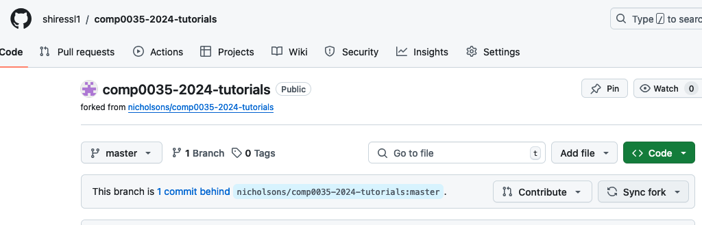
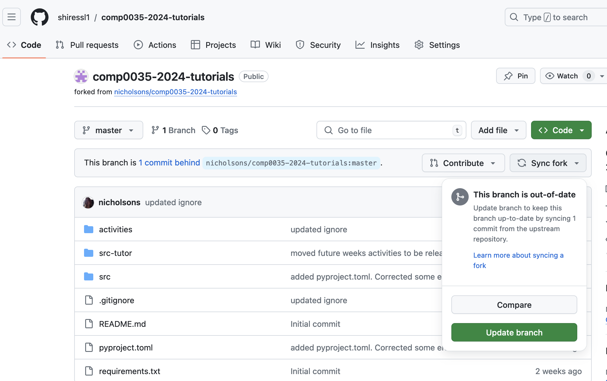
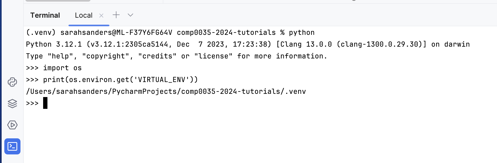

# Set-up instructions

## Pre-requisites

The activities assume that you have forked the COMP0035 tutorials repository, cloned it to your computer, and set up a
project with a virtual environment within your IDE (VS Code or PyCharm).

### 1. Update the forked tutorials repository

Login to GitHub and navigate to your forked copy of the COMP0035 tutorials repository.

Check whether any changes have been made. For example, the image below shows 1 new commit has been made to the original.


If changes have been made, you will need to update your forked repository.

Click on the "Synch fork" button; and then on "Update branch".


Now, open your IDE (VS Code, PyCharm) and update the local copy of the repository. This assumes you have integrated your
IDE with your GitHub account in week 1. You may be prompted to log in to GitHub before you can carry out the
following.

- In PyCharm try menu option Git > Pull
- In VS Code click on the source code control icon on the left side panel, then when the source code control pane opens,
  click on the three dots and select Pull.

There are other methods, look in the Help for either PyCharm or VSCode.

### 2. Check you have the virtual environment activated

Open a terminal window within your IDE in the project directory.

Check that your virtual environment is activated. There are various ways to do this, IDEs vary, usually a quick visual
way is to check whether the prompt starts with `(.venv)` or the name if your venv folder if not `.venv`. You can also
use Python in the Terminal:

```python
import os

print(os.environ.get('VIRTUAL_ENV'))
```

The following screenshot shows this in PyCharm on macOS:



If you are not in a venv, refer to [Week 1 activity 7](../week1/1-7-create-virtual-environment.md) for instructions.

## Configure your IDE to work with database

If you are using PyCharm Professional version (free with student id) you do not need to install anything further to
enable it to work with databases.

If you are using VS Code, you will need to add the following extensions to work with SQLite files:

- [SQlite](https://marketplace.visualstudio.com/items?itemName=alexcvzz.vscode-sqlite)
- [SQLite Viewer](https://marketplace.visualstudio.com/items?itemName=qwtel.sqlite-viewer)

## Complete the activities

Use the version of the data files in the `data_db_activity` directory for these activities.

Tutorial activities can be found in the activities/week5 folder. These are:

1. [Introduction: Using Python sqlite3 and pandas to create SQLite databases](5-1-introduction.md)
2. [Create an un_normalised database from a pandas dataframe](5-2-create-studentdb-unnormalised.md)
3. [Create the structure for a normalised database using SQL, sqlite3 and pandas dataframe](5-3-studentdb-normalised-structure.md)
4. [Introduction to SQL SELECT for finding values from a table](5-4-select-query.md)
5. [Introduction to SQL INSERT for adding values to a table](5-5-insert-query.md)
6. [Add data to the normalised database](5-6-studentdb-normalised-add-data.md)
7. [Apply the knowledge to create the paralympics database](5-7-create-paralympics-db.md)

## Apply the knowledge to your coursework project

- Define and create the structure for the database
- Add data to the database from your prepared data set

Do some extra research. There are many tutorials publicly available that focus on data preparation and exploration with
pandas. Try to find examples that do more that has been covered in this tutorial to expand your knowledge.
