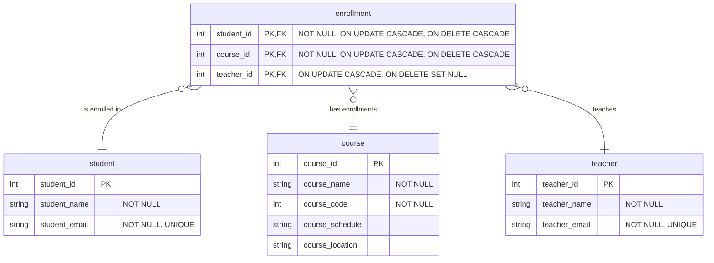
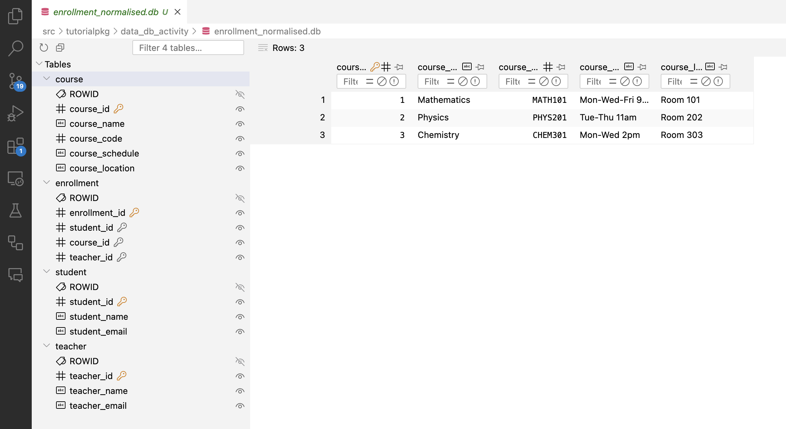
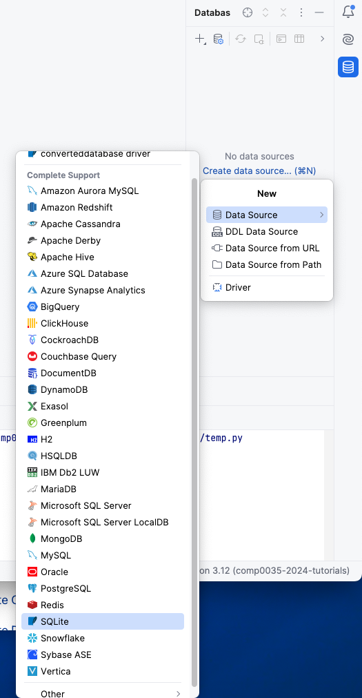
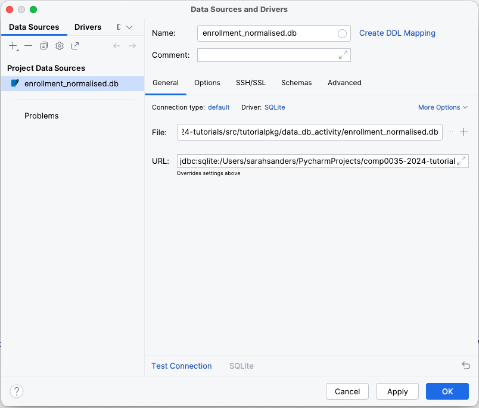
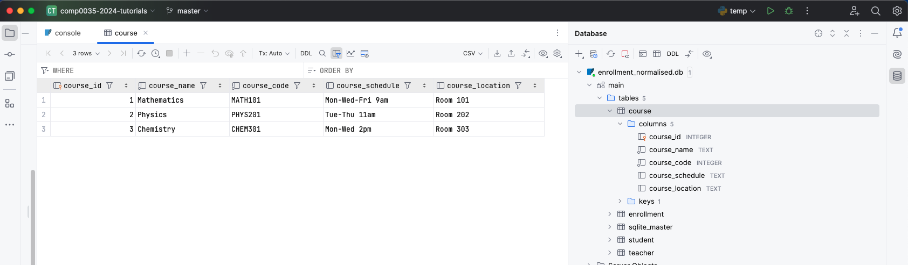

# 3. Use pandas, sqlite3 and SQL to create a normalised database

## ERD

The ERD to 3NF for the database is as follows. This assumes that a course could be taught by different teachers so a
teacher is specific to an enrollment and not to a course. If a Student, Course or Teacher is deleted then it is also
deleted from the enrollment table.



## Define the tables

In principle, the Student, Teacher and Course tables can be created in the same way as you did for the single table,
passing only the relevant fields from the dataframe to each table. The primary key field values do not exist so will
need to be created. This could be done in pandas by generating values for the column starting from 1 e.g.
`student_df['student_id'] = student_df.index + 1`

The Enrollment table however needs to have foreign keys linked to values from the primary keys of the other tables; so
creating the table and inserting the data correctly requires more work.

The approach used in this activity is:

- Write SQL statements that define the tables, attributes, keys and constraints
- Create a connection to the database using sqlite3
- Create a sqlite3 cursor that will be used to execute the SQL
- Execute the SQL using sqlite3 to create the database structure
- Use pandas to load the data from .csv
- Use sqlite3 and SQL queries to add the data from the dataframe to the database

This is not the only way to work with these tools to create a database. Other approaches could include:

- Add the data to the tables using pandas.to_sql, and then use SQL to add the PK and other constraints to the tables
  after you create them using `ALTER TABLE`
- Create an un-normalised table and add the data to it, then create the other tables using `CREATE TABLE ... AS SELECT`;
  and finally delete the original table.
- Use other Python libraries such as `sqlalchemy` (this will be introduced in COMP0034).

... and there are other options. You may find a different, or more efficient, solution.

## Using SQL

Structured Query Language or SQL provides a syntax for creating relational database. In this course you will use SQLite
variant.

- [SQLite documentation](https://www.sqlite.org/docs.html)
- [general SQL references](https://www.w3schools.com/sql/)

The general structure of a SQLite statement to [create a table](https://www.sqlite.org/lang_createtable.html) is:

```SQL
CREATE TABLE table_name_1
(
    column_name_1 data_type PRIMARY KEY,
    column_name_2 data_type NOT NULL,
    column_name_3 data_type NOT NULL UNIQUE,
    FOREIGN KEY (column_name_1) REFERENCES table_name_2 (column_name_1)
);

CREATE TABLE table_name_2
(
    column_name_1 data_type PRIMARY KEY,
    column_name_2 data_type
);
```

SQL keywords are not case-sensitive, writing 'create table' as the same effect as 'CREATE TABLE'. By convention the SQL
keywords are upper case and adhering to this makes your code more readable by others.

The `;` at the end of a SQL statement is required by some database management systems and is used to separate SQL
statements.

SQLite data types differ to SQL data types and are:

## 1. Write SQL statements to define the tables

1. Create a new function in your database module to create a normalised database for the student enrollment data that
   takes a dataframe as its parameter.
2. Add python strings containing SQL statements that define the tables, their keys and any constraints. Below is the SQL
   code for the most complex table, Enrollment. Use the ERD at the top of this activity and write the code yourself for
   the other tables. Note in SQLite an INTEGER PRIMARY KEY will AUTOINCREMENT so you do not need to add that keyword
   constraint.

    ```python
    student_sql = '''ADD SQL'''
    teacher_sql = '''ADD SQL'''
    course_sql = '''ADD SQL'''
    enrollment_sql = '''CREATE TABLE enrollment (
                                student_id INTEGER NOT NULL, 
                                course_id INTEGER NOT NULL,
                                teacher_id INTEGER,
                                PRIMARY KEY (student_id, course_id, teacher_id),
                                FOREIGN KEY (student_id) REFERENCES student(student_id) ON DELETE CASCADE ON UPDATE CASCADE,
                                FOREIGN KEY (course_id) REFERENCES course(course_id) ON DELETE CASCADE ON UPDATE CASCADE,
                                FOREIGN KEY (teacher_id) REFERENCES teacher(teacher_id) ON UPDATE CASCADE ON DELETE SET NULL);
                                '''
    ```

3. As for activity 5-2, add code to create the connection to the database.
4. To execute SQL you need to create a cursor object using the connection. This can be some like this:
   `cursor = connection.cursor()`
5. `Sqlite` does not enable foreign key support by default, you need to execute the following SQL before you create the
   tables

    ```python
    # By default, foreign key constraints are disabled in SQLite, enable them explicitly for each database connection.
    cursor.execute('PRAGMA foreign_keys = ON;')
    
    # Commit the changes
    connection.commit()
    ```

6. Add code to `execute()` and `commit()` the sql to create the tables. To execute the SQL from step 2 for example:
   `cursor.execute(enrollment_sql)`.
7. Finally close the connection `connection.close()`
8. Try running code to call the function and it should now create the database.

## View the database structure in VS Code or PyCharm

If you added one of the VS Code extensions for viewing SQLite databases then you should be able to open the database
file from the project file list in VS Code and explore the structure.

For example:



In PyCharm Professional (not available in the standard version) there is a database pane in the IDE. Select it by
clicking on the icon 

Select options to add a new data source with the type SQLite 

Select the location of the database file. If the driver at the bottom of the screen does not show as SQLite then there
will be an option to install it instead which you should select.



You can then expand the view to look at the tables, and double-click on a table to open the view of the data added to
the table.



## Tables that already exist

If you were successful above then you have a database with tables.

If you now try to run the code again you will get an error such as this:

```text
An error occurred creating the database. Error: table student already exists
```

You may need to make changes to correct issues you've spotted and want to create the database again. You could just
delete the file, it is preferable to handle this in your code.

You could add Python error handling (`try/except`); however, SQL has options that you can use if a table exists:

- Change the SQL so that if the table already exists it is not created e.g. `CREATE TABLE IF NOT EXISTS some_table ...`.
  This may not be what you want though if the table needed to change.
- Delete the table and then recreate it, for example add this before the code to create each table
  `DROP TABLE IF EXISTS tablename;`

Another option is to alter the existing table. Refer to
the [ALTER TABLE documentation for SQL](https://www.w3schools.com/sql/sql_alter.asp)
or [sqlite ALTER TABLE](https://www.sqlite.org/lang_altertable.html)

[Next activity](5-4-select-query.md)
