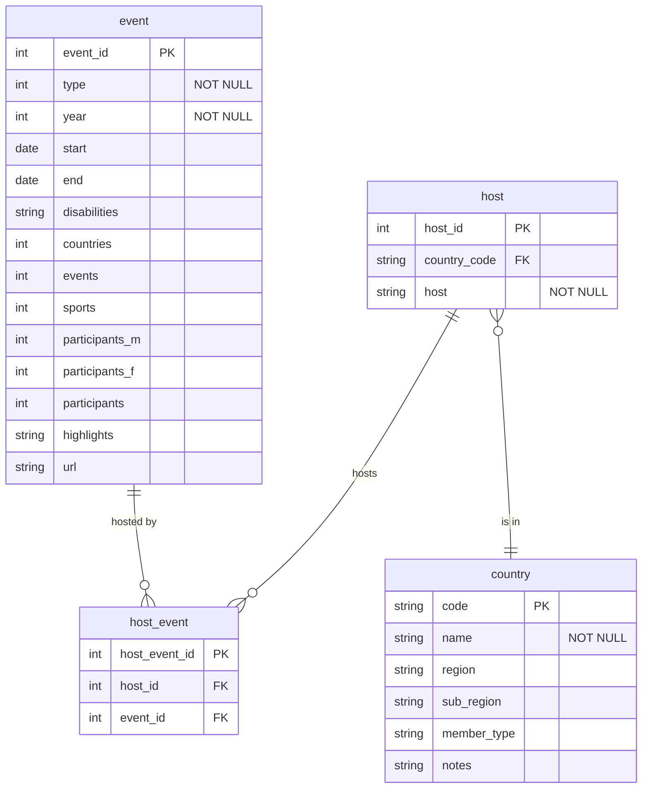

# 7. Create the paralympics database

This will be challenging as you are given less guidance.

Be prepared to look things up in pandas and sqlite3 references, or use copilot or chatGPT.

Expect this to take 30 minutes or more.

## 1. Create a database with a single table for the paralympics data

Write code to save the data
from [paralympics_events.csv](../../src/tutorialpkg/data_db_activity/paralympics_events.csv) to a
single table in an SQLite database. This version of the data differs slightly to the version used in the week 2
activities.

This is similar to [Activity 5-2](5-2-create-studentdb-unnormalised.md).

## 2. Create a database with multiple related tables for the paralympics data

Use the data in the Excel data
file: [paralympics_all.xlsx](../../src/tutorialpkg/data_db_activity/paralympics_all.xlsx). You will need the `events`
and `npc_codes` worksheets.

Write code to create a database that represents the following ERD; and add the data to it with relevant value in the
PK/FK fields.



You may find it easier to create multiple Python functions in this activity to isolate aspects of your code as you work.
The tutor solution that will be released next week does this to make it easier to read.

### 1. Create the database structure

Check the column names in the dataframes as these are not always exactly the same as the database attribute names!

Key points to note:

- Enable the foreign key support first
  `cursor.execute('PRAGMA foreign_keys = ON;')`.
- Define the tables using SQL. You will need to look
  up [how to define date fields in SQLite](https://www.sqlite.org/datatype3.html#date_and_time_datatype)!
- Execute the sql to create the tables and commit the changes. The order you create the tables is important. If a table
  had a foreign key, the table that has that key as its primary key needs to be created first.
- Use your IDE to check that the database has been created successfully.

### Add data to the country table

This table does not have any Foreign Key fields so create it before any tables that depend on its primary key.

Add all the columns and rows from the `npc_codes` sheet in the Excel file to the `country` table.

If you created the database columns in the same order as the columns in the dataframe then you can use `pd.to_sql`
rather than SQL if you prefer. You will need to set `if_exists='replace', index=False` in `df.to_sql()`.

### Add data to the event table

This table does not have any Foreign Key fields so create it before any tables that depend on its primary key.

Add all the values from the following columns only of `events` sheet in the Excel file to the `country` table.

```python
columns = '''type, year, start, end, disabilities, countries, events, sports, participants_m, 
                participants_f, participants, highlights, url'''
```

You may need to convert the dates to stringe before you can insert them, e.g.

```python
# Convert the dates to strings
df['start'] = df['start'].dt.strftime('%d/%m/%Y')
df['end'] = df['end'].dt.strftime('%d/%m/%Y')

# Insert the values into the event table
for index, row in df.iterrows():
    columns = "type, year, start, end, disabilities, countries, events, sports, participants_m, participants_f, participants, highlights, url"
    values = (
        row['type'],
        row['year'],
        str(row['start']),
        str(row['end']),
        row['disabilities'],
        row['countries'],
        row['events'],
        row['sports'],
        row['participants_m'],
        row['participants_f'],
        row['participants'],
        row['highlights'],
        row['url'])
    cursor.execute(f'INSERT INTO event ({columns}) VALUES (?,?,?,?,?,?,?,?,?,?,?,?,?)', values)
```

### Add data to the host table

This table has a foreign key attribute.

For each row in the events table, find the country_code from the country table by checking where the 'country' value in
the row matches the 'name' value in the 'country' table. You can use the same approach used in the enrollment table in
the student database.

A further complexity is that in one of the rows of the dataframe, the 'host' and 'country' have multiple values. You
need
to split these values and create a new dataframe with a row for each pair. One way to do this is:

```python
# Extract unique host and country pairs

# Initialize an empty DataFrame with the columns needed
host_country_df = pd.DataFrame(columns=['host', 'country', 'host_id'])

# Iterate over each row in the events DataFrame and split each column into multiple values where there is ','
for index, row in df_events.iterrows():
    hosts = row['host'].split(',')
    countries = row['country'].split(',')

    # Create pairs of each host with each country and append to the DataFrame
    for host, country in zip(hosts, countries):
        new_row = pd.DataFrame({'host': [host.strip()], 'country': [country.strip()]})
        host_country_df = pd.concat([host_country_df, new_row], ignore_index=True)

# Finally, remove duplicate hosts from the dataframe
host_country_df = host_country_df.drop_duplicates(subset=['host', 'country'])
```

You can then use the host_country_df rather than events_df for the row values that need to be added to the host table.

### Add data to the host_event table

This table has two foreign keys, event(event_id) and host(host_id).

As with the host table, you need to handle the row that has multiple values in the host column. The values are separate
by a comma (`,`).

The following code may be useful:

```python
# Iterate each event, find the pairs of hosts, then get the event_id and host_id and insert into the host_event table
for index, row in df.iterrows():
    # Find the event id for the event. This matches based on the year and type of event.
    result = cursor.execute('SELECT event_id FROM event WHERE year = ? AND type = ?', (row['year'], row['type'])).fetchone()
    event_id = result[0]
    # Split the hosts into a list
    hosts = row['host'].split(',')
    # Find the host_id for each host
    for host in hosts:
        host_value = host.strip()  # Remove any leading or trailing spaces
        result = cursor.execute(f'SELECT host_id FROM host WHERE host = "{host_value}"').fetchone()
        host_id = result[0]
        # Insert the host_event pair
        cursor.execute('INSERT INTO host_event (host_id, event_id) VALUES (?, ?)', (host_id, event_id))
```
## 3. Challenging: Include the medal standings data in the paralympics database

Define and create a database that includes the events, npc code and the medal standings data.

There is no tutor solution for this so you will need to decide on the table structure and the PK/FK relationships.
