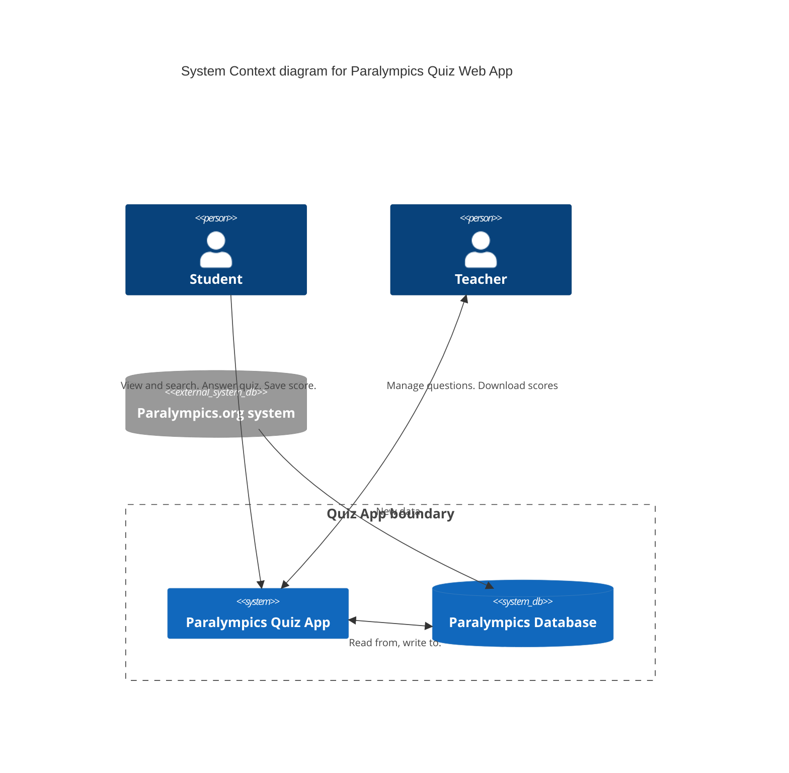
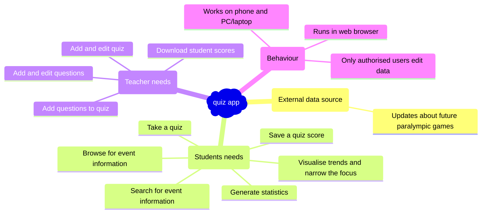

# 2. Identify requirements

## What is a requirement?

Requirements set out what a software system should do along with any constraints imposed on its operation and
implementation.

A requirement is some capability needed by a stakeholder to solve a particular problem or achieve an objective. The
requirements define a capability that the solution (web app) you will design and deliver has to have for it to be
considered by the stakeholders as meeting their needs.

In the context of the coursework project, the stakeholders are the imagined people who will be using the web app.

Requirements are often discussed in two broad categories:

1. **Functional requirements** are those that specify *what* the system should do; that is a behaviour, feature or
   function of a system. For example:

    - "Create a new customer account"

2. **Non-functional requirements** are those that specify *how* the system should. These often have implications for the
   system architecture and sometimes sub categorised by performance, availability, reliability, usability, flexibility,
   configurability, integration, maintainability, portability, and testability. For example:

    - "The application must support devices running OS verions 3.4, 3.5 and 3.6"
    - "The error rate of users submitting their payment details at the checkout page must not exceed 10%."

## Context diagram

While not essential, a context diagram may be useful as a next step as can help you to consider:

- what is the 'system' boundary, i.e., what is in the web app (the system), what is definitely not in it
- who or what (e.g., another system) interacts with the 'system' (external entities)
- what information needs to flow between the 'system' and the 'external entities'

Consider the following context diagram for the quiz app:

## Identify the requirements

The [Business Analysis Body of Knowledge (BABOK)](https://babokpage.wordpress.com/elicitation/) lists techniques that
can be used in a real world project to elicit requirements. You would gather requirements using one or more of these
techniques:

- Interview
- Workshop
- Survey/ Questionnaire
- Interface analysis
- Focus group
- Observation or ethnography
- Brainstorming
- Prototyping
- Analysing documentation

In this course, since there are no users for you to talk to, and you are not allowed to involve others outside the
course as requires ethics approval that you do not have, then your options are limited.

Useful techniques for the coursework include brainstorming, low fidelity prototyping (e.g. wireframes), looking at
similar existing web apps.

For this example consider the context diagram and brainstorm what the users of the app may need to be able to do.

The following mindmap represents the potential results of a brainstorming activity (apologies for the awful colours!):

## Activity: Brainstorm requirements for the prediction app

Identify requirements for the prediction app.

|                 | Paralympics prediction app                                                                                                                                                                                                                                                                                                                                                                                                                                                                 |
|:----------------|:-------------------------------------------------------------------------------------------------------------------------------------------------------------------------------------------------------------------------------------------------------------------------------------------------------------------------------------------------------------------------------------------------------------------------------------------------------------------------------------------|
| Target audience | UK school pupils aged 16 to 18. These students are used to using mobile phones and web based apps.                                                                                                                                                                                                                                                                                                                                                                                         |
| App overview    | A web app that includes a machine learning prediction algorithm to predict country medal results in future paralympic games. Historical medal rankings will be included in the app. The app will use the paralympics dataset medal rankings; and a machine learning model trained on the dataset.                                                                                                                                                                                          |
| Scenario        | Students have been asked to learn about the medal rankings in previous paralympic games, and to make predictions for the next paralympic games including: <ul><li>How will the UK perform?</li><li>Which countries will be in the top 10?</li><li>Which country will win the most gold medals?</li></ul>They will use the app to research historical medal tables, and then use a prediction page to generate answers to the questions. They expect to use the app on their mobile phones. |

[Next activity](6-3-document-requirements.md)