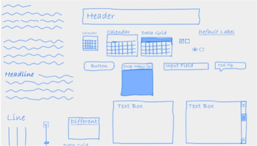
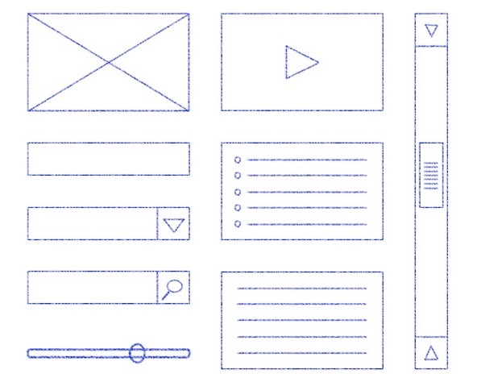
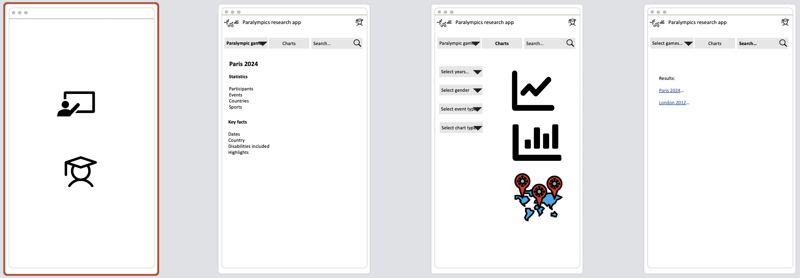

# 6. Drawing wireframes

## What is a wireframe?

A wireframe is a low fidelity design of an application that allows you to focus on basic layout and interaction of an
interface independent of styling. It is typically used for early prototyping in web applications, though it is not the
only technique that can be used.

It provides an outline of the structure and layout and presents the main information and application flows.

The following examples show both hand drawn and digital wireframes:

| Hand-drawn                                                                                                                                | Digital                                                                                                    |
|:------------------------------------------------------------------------------------------------------------------------------------------|:-----------------------------------------------------------------------------------------------------------|
|  |  |

## Why create a wireframe?

"A picture is worth a thousand words", wireframes clearly communicate design ideas to stakeholders and teammates to
facilitate decision-making. Wireframes can provide a reference point for the functionality that will need to be built.

They are quick to create and change so you can explore ideas with minimal effort. Keeping it lo-fi (sketch) helps avoid
a focus on visual design.

Some use wireframes to help capture and/or refine requirements; others develop them after the requirements are
documented. Whenever you start there is likely to be some iteration.

## Which screen size(s) and orientation are you designing for?

Consider your target user group and design for the screen size they are most likely to use.
For example, designing for a user audience primarily using a phone would imply a different layout to a target audience
primarily using a laptop or desktop PC (not least as one is portrait and the others landscape in orientation).

[Statcounter.com](https://gs.statcounter.com/screen-resolution-stats) provides statistics for the most commonly used
screen sizes.

## How to create wireframes

There is no single format or approach to creating wireframes.

This is a generalised approach that is influenced by Alex Coleman's
article [How to create web application wireframes](https://selftaughtcoders.com/how-to-create-web-application-wireframes/)
.

1. Start with your requirements (e.g. user stories), and/or if you have them use cases.
   Try to write down the key goals the user has when using your web app, e.g.

    - Create and manage user account
        - Create an account
        - Update account e.g. change password
        - Login
        - Logout
    - Analyse data using chart X
        - View chart X
        - Tailor chart X
    - Manage data (e.g. in the tutorial example project this might be managing the data associated with a paralympic
      event)
        - Search for an existing data entry and view it
        - Create a new data entry
        - Update/edit an existing data entry

2. For each of the above sketch out a potential wireframe of the page (or area of the page if a single page app design
   is used for a dashboard style app).

3. Optionally, consider how the user may navigate from one page/feature to the next. A flow chart may be useful here.

## Wireframe tools

Wireframes use generic shapes. You can hand draw wireframes. Most basic shapes can be created in Powerpoint.

There are numerous online wireframe tools such as Balsamiq, Adobe, etc. They usually require sign up and if you use
these, ensure you save and download your designs in an image format (e.g., png, jpd, pdf) before the trial expires.

While not design tools, if your wireframes contain charts, and you want to understand the options, these chart chooser
tools may help:

- [data visualisation catalogue](https://datavizcatalogue.com/index.html)
- [interactive chart chooser](https://depictdatastudio.com/charts/)
- [data to viz](https://www.data-to-viz.com/)

## Activity: draw wireframes

The following attempt to sketch the screens for the paralympic games fact pages, the chart selector and the search.

Draw your own wireframes for the student user stories related to taking a quiz and saving their score. There is
a [basic wireframe PowerPoint file](../files/wireframes.pptx) in the '/activities/files' folder.

Do your wireframes highlight any new user stories that need to be added? Or any constraints that need to be added to the
existing user stories?
