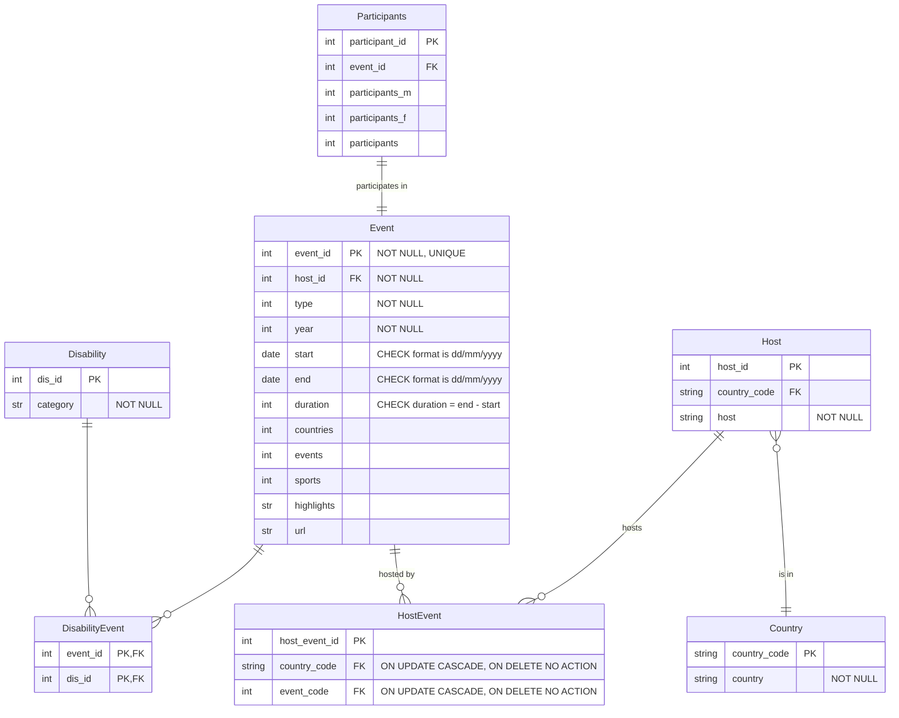
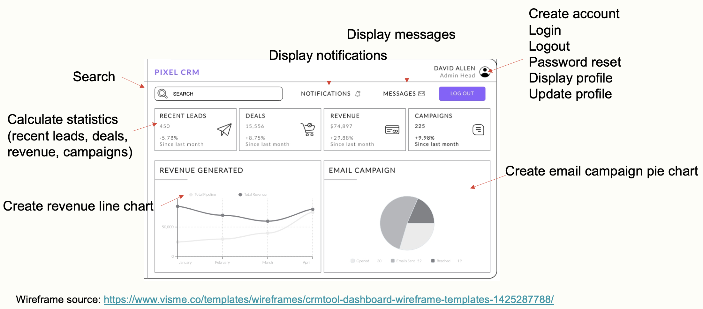

# 2. Application design: Identify Python classes and functions

## MVC

The goal of the MVC design pattern is to separate the organization of data (model) from the user interface and
presentation (view) by introducing a controller. It is a common design pattern for web applications and is explained
elsewhere in the teaching materials so is not repeated here.

You do not have to design your web app following this pattern. It is used in the tutorial as it offers a structured way
for you to start the application design.

**Routes and controllers**: Each _route_ in a web app has a _controller_ action. When you enter a URL, the application
attempts to find a matching route, and, if it’s successful, it calls that route’s controller action. Within the
controller action, two main things typically occur: the models are used to retrieve all the necessary data from a
database; and that data is passed to a view, which renders the requested page.

**Models**: Represent the data and its related logic. It interacts with the database and determines the data that is
being transferred to the controller. We will use the ORM pattern to map between these model classes and the database
tables.

**Views**: In the view, the data is accessed and the information contained within is used to render the HTML content of
the page the user ultimately sees in their browser. In the coursework, the design of the views is represented by the
wireframes.

## Identify the Python classes

### Identify classes from the database design

You already documented a database design using the ERD format. This is a good starting point for identifying classes.

The version of the ERD below uses all the raw data, and not the reduced set from week 3.

This ERD was written before we had gathered the requirements. The app will need more classes than just those that map to
the stored data.

Considering the ORM pattern, each of the tables also represents a potential Python class:

- Event: type, year, start, end, duration, countries, events, sports, highlights, url
- Country: country_code, country_name
- Disability: category
- Host: host_name
- Participants: participants_m, participants_f, participants

### From the requirements

Another way to identify the potential classes is to read the requirements (user stories in this case) and apply a data
driven design approach:

- Nouns and noun phrases in the requirements suggest classes
- Adjectives suggest an attribute of a class
- Verbs and verb phrases suggest functions

In this activity the application design considers all the requirements. For the coursework you may limit your design to
cover only the 'Must' and 'Should' have requirements.

Read the user stories below and underline:

- Nouns and noun phrases in the requirements suggest classes
- Adjectives suggest an attribute of a class
- Verbs and verb phrases suggest functions

| Ref | User story                                                                                                                                                                                                             | Constraints                                                                                                                                                                                                                                                                                                                                                                                                                                   | Priority |
|:----|:-----------------------------------------------------------------------------------------------------------------------------------------------------------------------------------------------------------------------|:----------------------------------------------------------------------------------------------------------------------------------------------------------------------------------------------------------------------------------------------------------------------------------------------------------------------------------------------------------------------------------------------------------------------------------------------|:---------|
| 3.  | As a <u>student</u> I want to <u>browse information</u> about paralympic games so that I can see what is available.                                                                                                    |                                                                                                                                                                                                                                                                                                                                                                                                                                               | Must     |
| 5.  | As a student I want to <u>view statistical information</u> about the paralympics for each event and across events so that I can find information for my project.                                                       | Must include number of <u>sports</u>, <u>participants</u> and <u>events</u>.                                                                                                                                                                                                                                                                                                                                                                  | Must     |
| 12. | As a student or <u>teacher</u> I want to be able to access the quiz app from a PC or mobile phone so that I can work at home or in school.                                                                             |                                                                                                                                                                                                                                                                                                                                                                                                                                               | Must     |
| 13. | As a student or teacher I want to be able to use the app through a web browser so that I do not have to install an application on my device.                                                                           | Supports the 3 most frequently used browsers in the UK region.                                                                                                                                                                                                                                                                                                                                                                                | Must     |
| 2.  | As a system administrator, I want to make sure that only a teacher can edit <u>questions</u> and <u>quizzes</u>, and access student <u>scores</u>.                                                                     | Authentication must <u>use the school's single sign on method</u>.                                                                                                                                                                                                                                                                                                                                                                            | Should   |
| 4.  | As a student I want to <u>search for information</u> so that I can <u>answer quiz questions</u>.                                                                                                                       | Search should find data in any of the tables related to the events.                                                                                                                                                                                                                                                                                                                                                                           | Should   |
| 6.  | As a student I want to <u>see charts</u> that <u>show trends over time</u> in the events data and be able to <u>refine the charts</u> to specific fields or date ranges so that I can find information for my project. | Support <u>filter by date range, event type (summer/winter), gender and disabilities included</u>. Chart types include line, bar and map.                                                                                                                                                                                                                                                                                                  | Should   |
| 7.  | As a student I want to <u>complete a quiz</u> so that I can assess my learning.                                                                                                                                        |                                                                                                                                                                                                                                                                                                                                                                                                                                               | Should   |
| 9.  | As a teacher I want to <u>add and edit questions</u> so that these <u>can be added to quizzes</u>.                                                                                                                     | Allow <u>multiple choice question type</u>.                                                                                                                                                                                                                                                                                                                                                                                                   | Should   |
| 10. | As a teacher I want to <u>add and edit quizzes</u>, including <u>adding questions</u> to them, so that I can offer my students formative assessment.                                                                   | A                                                                                                                                                                                                                                                                      <u>question</u> can be added to more than one quiz. A question has multiple answers. An <u>answer</u> is <u>correct or incorrect</u>. A question has a score. | Should   |
| 8.  | As a student I want to <u>submit my quiz score</u> so that I can participate in the competition to see who scores the highest.                                                                                         |                                                                                                                                                                                                                                                                                                                                                                                                                                               | Could    |
| 11. | As a teacher I want to <u>access students' scores</u> to see which student gained the highest score.                                                                                                                   | Display <u>student first name, last name and score</u>. Optionally allow download to .txt file.                                                                                                                                                                                                                                                                                                                                            | Could    |
| 1.  | As a system administrator I want to <u>make updates to the paralympic games database</u> so that the data remains accurate and up to date.                                                                             | Updates will be requested once per day. A request will be triggered in the quiz app and will use the paralympics API to look for changes since the last date of update. Any changes will be updated in the database. The <u>last update date</u> will be stored.                                                                                                                                                                        | Won't    |

A partial list of nouns and adjectives:

- Student
- Teacher
- Statistic: sports, participants, events
- Chart: chart type
- Quiz: name

A partial list of verbs and verb phrases:

- browse information
- view statistics
- answer question
- search
- see chart
- complete quiz

> Read the user stories and complete the lists above.

### Identifying classes from use cases

This is not covered in the teaching materials. However, if you create use cases in the coursework
this [guide to identifying an MVC design from use cases](https://guides.visual-paradigm.com/from-use-case-to-mvc-framework-a-guide-object-oriented-system-development/)
may be useful.

## Review the list of classes, attributes and functions

> Review the list of classes and their attributes. You will need to complete the following with the results of the previous step:

- Event: type, year, start, end, duration, countries, events, sports, highlights, url
- Country: country_code, country_name
- Disability: category
- Host: host_name
- Participants: participants_m, participants_f, participants
- Student
- Teacher
- Statistic: sports, participants, events
- Chart: chart type
- Quiz: name

Remove duplicates (e.g., Statistic and its attributes is already covered by the Event class in the ERD, though you could
consider splitting the event into two classes).

Consider any missing attributes and add them.

You could also review the classes and functions against the wireframes to check for completeness, e.g.

> Review the list of functions. You will need to complete the following with the results of the previous step:

- view_webpage (replaced 'browse_information')
- view_statistics
- answer_question
- search
- view_chart
- complete_quiz