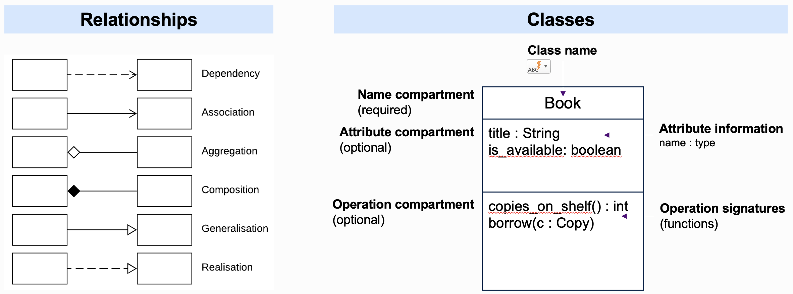
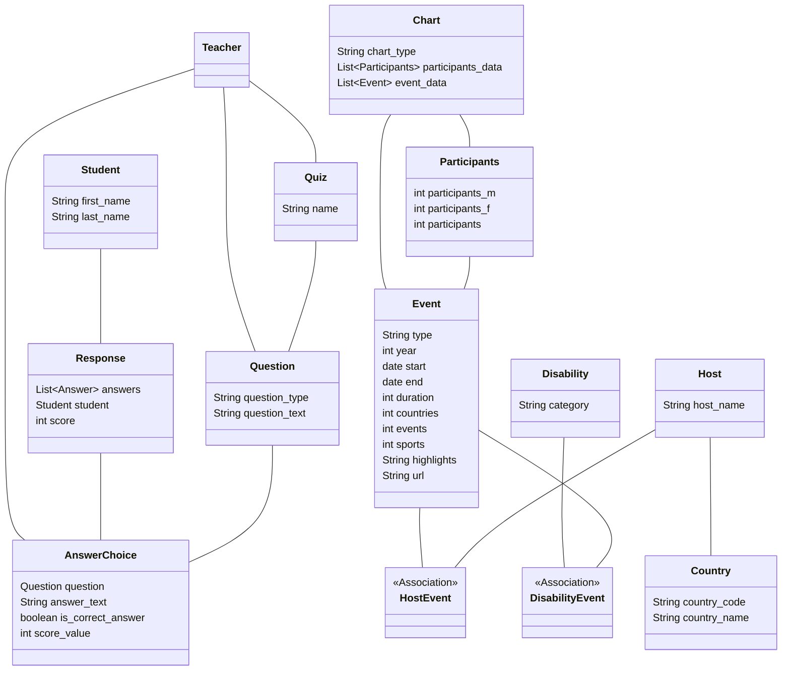
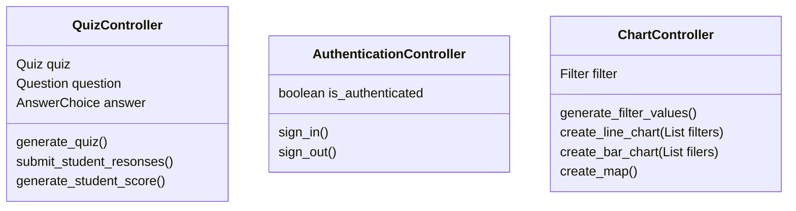
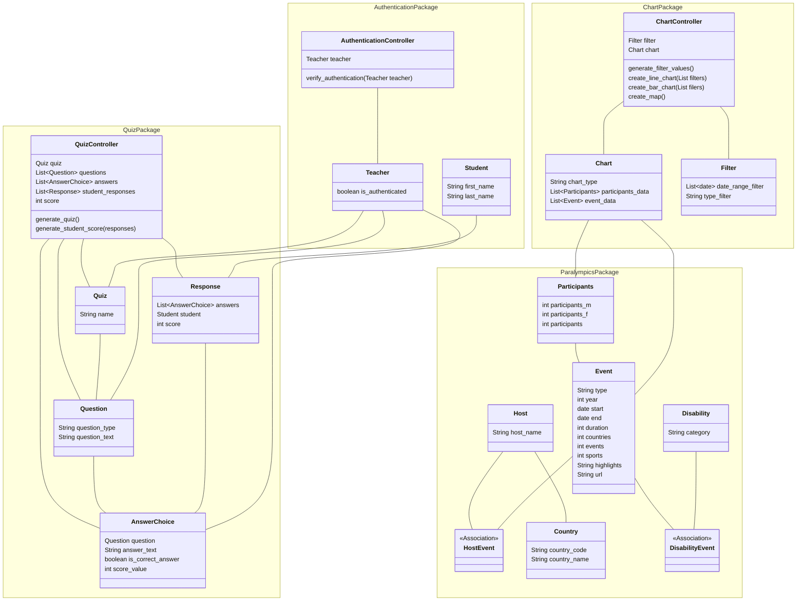

# 3. Draw design

## Select the diagram format

In this activity, we will use the UML class diagram, though may not fully adhere to this.

Mermaid is used as you should have installed this in order to view the activities.

You can draw the diagram on paper instead which may be easier as you won't have to learn the Mermaid syntax to do so.

Remember the following symbols for classes and relationships:

## Add the model classes

The following were derived from the ERD and the activities to identify classes from the user stories.

## Add the controller classes

These control the business logic. I have grouped them according to function, you may choose a different way to group
them. There is no single way to design these!

If not following the MVC model, these operations may be in the relevant model classes.

The logic to create, read, update and delete any of the model classes will be handled by the ORM so have not been added
here. You can add them to the class diagram if you prefer.

## Add all the classes to the class diagram and add the relationships

The 'view' classes have been omitted in the diagram below. In the coursework you have represented these with the
wireframes.

You may not agree with this diagram, you may have made different choices to structure it differently.

This version also groups the Python classes into Python packages. This is not required.

[Next activity](7-4-review-design.md)