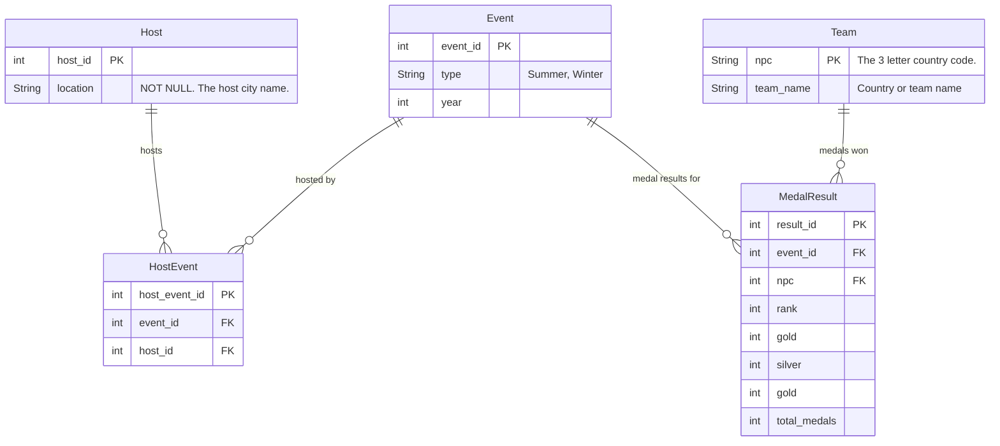

# 5. Draw the application design for the paralympics prediction web app

## Project overview

|                 | Paralympics prediction app                                                                                                                                                                                                                                                                                                                                                                                                                                                                 |
|:----------------|:-------------------------------------------------------------------------------------------------------------------------------------------------------------------------------------------------------------------------------------------------------------------------------------------------------------------------------------------------------------------------------------------------------------------------------------------------------------------------------------------|
| Target audience | UK school pupils aged 16 to 18. These students are used to using mobile phones and web based apps.                                                                                                                                                                                                                                                                                                                                                                                         |
| App overview    | A web app that includes a machine learning prediction algorithm to predict country medal results in future paralympic games. Historical medal rankings will be included in the app. The app will use the paralympics dataset medal rankings; and a machine learning model trained on the dataset.                                                                                                                                                                                          |
| Scenario        | Students have been asked to learn about the medal rankings in previous paralympic games, and to make predictions for the next paralympic games including: <ul><li>How will the UK perform?</li><li>Which countries will be in the top 10?</li><li>Which country will win the most gold medals?</li></ul>They will use the app to research historical medal tables, and then use a prediction page to generate answers to the questions. They expect to use the app on their mobile phones. |

### User stories

This is an abbreviated version of user stories for the design activity. The "... so that ...", prioritisation and
reference number have been omitted.

- As a student I want to see the medal results table for each paralympic games. I want to be able to filter the list for
  the top 10.
- As a student I want to enter the country name and future year and get a prediction of the gold, silver and bronze
  medals for that country in the specified paralympics.
- As a student I want to be able to predict the top 10 countries in the next paralympics.
- As a system administrator I want to add new data to the database when future paralympics take place.

For the purposes of the activity, assume that it is possible to create machine learning models that can predict the
results.

### ERD

The medal_standings worksheet in the [paralympics_all.xlsx](../../src/tutorialpkg/data_db_activity/paralympics_all.xlsx)
has the following columns:

Location: name of the paralympics host
Year: year
Rank: rank of the team
Team: country, or team, name
NPC: country code
Gold: number of gold medals
Silver: number of silver medals
Bronze: number of bronze medals
Total: total number of medals (bronze, silver and gold)

The ERD might look like this:

## Create an application design

Refer to activities 1 to 4 to help you.

1. Review the user stories to identify potential classes and their attributes and operations (functions). Underline
   nouns (potential classes or attribute), verbs or verb phrases (potential functions).
2. Review the classes in the ERD.
3. Combine the classes and review for duplicates.
4. Draw the class diagram. Add the classes. Draw the relationships between the classes.
5. Review the diagram against the design principles. Make changes if required.

[Next activity](7-6-genAI.md)