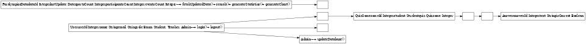

# Generative AI in application design

## Tools used

The following tools were tried in relation to this week's activities:

- [Goblin Tools professor](https://goblin.tools/Professor) - for summary explanations of design concepts. Prompts used:

    - `Explain the DRY design principle`
    - `Explain the low coupling design principle`
    - `Explain the high cohesion design principle`
    - `Explain the purpose of a UML class diagram`
    - The responses generated at the time were concise and consistent with teaching materials. Responses were
      illustrated with an example.
- [Microsoft copilot - accessed using UCL account](https://copilot.microsoft.com)

    - The prompt used was: `generate a class diagram from the attached use cases` with the user stories from activity
      7.2 pasted into the chat window.
    - The response is below and includes classes and attributes, and relationships. It did not identify class
      operations (functions).
    - A subsequent prompt was then entered:
      `To what extent does this class diagram meet the principles of low coupling and high cohesion?` and again the
      response is below.
- [chatGPT - free 'everyday tasks' version](https://chatgpt.com)

    - the same prompt was used as for copilot. The result included methods as well as classes and attributes,
      and relationships between classes. ChatGPT offered to draw this as a diagram but the result was not meaningful. A
      further prompt was then added
      `To what extent does this class diagram meet the principles of low coupling and high cohesion?`. The response to
      this was detailed and is included below.

As a learning outcome, it is recommended that you first attempt the activities without using gen AI tools as you need to
learn the technique before you can critically judge the output of a gen AI tool. Comparing your own work to the response
of a gen AI tool may give suggested areas where you could review your design.

## copilot response

To generate a UML class diagram from the provided user stories, we can identify the main classes, their attributes, and
relationships. Here's a simplified version of the class diagram based on your user stories:

### Classes and Attributes

1. **User**
    - userID
    - name
    - role (Student, Teacher, Admin)

2. **Student** (inherits from User)
    - studentID

3. **Teacher** (inherits from User)
    - teacherID

4. **SystemAdministrator** (inherits from User)
    - adminID

5. **ParalympicGame**
    - gameID
    - name
    - description

6. **Event**
    - eventID
    - name
    - type (Summer/Winter)
    - date
    - numberOfParticipants
    - numberOfSports

7. **Quiz**
    - quizID
    - title
    - description

8. **Question**
    - questionID
    - text
    - type (Multiple Choice)
    - score

9. **Answer**
    - answerID
    - text
    - isCorrect

10. **Score**
    - scoreID
    - studentID
    - quizID
    - value

### Relationships

- **User** has a one-to-many relationship with **Quiz** (created by Teacher).
- **Quiz** has a one-to-many relationship with **Question**.
- **Question** has a one-to-many relationship with **Answer**.
- **Student** has a many-to-many relationship with **Quiz** through **Score**.
- **ParalympicGame** has a one-to-many relationship with **Event**.

### Diagram

Here's a textual representation of the class diagram:

```
User
  - userID
  - name
  - role
  |
  |-- Student
  |    - studentID
  |
  |-- Teacher
  |    - teacherID
  |
  |-- SystemAdministrator
       - adminID

ParalympicGame
  - gameID
  - name
  - description
  |
  |-- Event
       - eventID
       - name
       - type
       - date
       - numberOfParticipants
       - numberOfSports

Quiz
  - quizID
  - title
  - description
  |
  |-- Question
  |    - questionID
  |    - text
  |    - type
  |    - score
  |    |
  |    |-- Answer
  |         - answerID
  |         - text
  |         - isCorrect

Score
  - scoreID
  - studentID
  - quizID
  - value
```

### Critically review the design

The class diagram you've provided generally adheres to the principles of low coupling and high cohesion, which are
essential for creating maintainable and scalable software systems. Let's break down how it meets these principles:

#### Low Coupling

Low coupling refers to minimizing dependencies between classes, making the system more modular and easier to maintain.

- **User and its subclasses (Student, Teacher, SystemAdministrator)**: These classes are well-separated, with each
  subclass inheriting from the User class. This inheritance structure reduces direct dependencies between different
  types of users.
- **Quiz and Question**: The relationship between Quiz and Question is clear and direct, with each quiz containing
  multiple questions. This relationship is necessary and does not introduce unnecessary dependencies.
- **Score**: The Score class acts as an intermediary between Student and Quiz, which helps in decoupling the direct
  relationship between these two classes. This design allows changes in the Quiz or Student class without significantly
  impacting the other.
- **ParalympicGame and Event**: The one-to-many relationship between ParalympicGame and Event is straightforward and
  necessary for representing the data structure, maintaining low coupling.

#### High Cohesion

High cohesion means that a class should have a single, well-defined responsibility and all its methods and properties
should be closely related to that responsibility.

- **User and its subclasses**: Each subclass (Student, Teacher, SystemAdministrator) has a specific role and
  responsibility, ensuring high cohesion within each class.
- **Quiz, Question, and Answer**: These classes are highly cohesive as they each have a clear, focused responsibility.
  The Quiz class manages quizzes, the Question class handles individual questions, and the Answer class deals with
  possible answers.
- **Score**: The Score class is cohesive as it solely manages the relationship between students and their quiz scores.
- **ParalympicGame and Event**: These classes are cohesive, with ParalympicGame managing overall game information and
  Event handling specific event details.

#### Summary

Overall, the class diagram demonstrates a good balance of low coupling and high cohesion. Each class has a clear
responsibility, and dependencies between classes are minimized where possible. This design should facilitate easier
maintenance and scalability of the system.

## chatgpt response

NB: The naming convention is not consistent with Python PEP8

### Key Classes and Attributes

1. User

Attributes:

- userId: Integer
- name: String
- email: String
- role: Enum {Student, Teacher, Admin}

Methods:

- login()
- logout()

2. Student (inherits from User)

Attributes:

- quizScores: List<QuizScore>

Methods:

- browseGames()
- viewStatistics()
- searchInformation()
- completeQuiz(quizId: Integer)
- submitScore(score: Integer)

3. Teacher (inherits from User)

Attributes:

- createdQuizzes: List<Quiz>

Methods:

- addQuestion(question: Question)
- editQuestion(questionId: Integer)
- createQuiz(quiz: Quiz)
- editQuiz(quizId: Integer)
- viewStudentScores()

4. Admin (inherits from User)

Methods:

- updateDatabase()

5. Quiz

Attributes:

- quizId: Integer
- title: String
- questions: List<Question>

Methods:

- addQuestion(question: Question)
- removeQuestion(questionId: Integer)

6. Question

Attributes:

- questionId: Integer
- text: String
- options: List<Answer>
- score: Integer

Methods:

- addAnswer(answer: Answer)
- editAnswer(answerId: Integer)

7. Answer

Attributes:

- answerId: Integer
- text: String
- isCorrect: Boolean

8. QuizScore

Attributes:

- scoreId: Integer
- student: Student
- quiz: Quiz
- score: Integer

9. ParalympicsData

Attributes:

- dataId: Integer
- lastUpdate: Date
- sportsCount: Integer
- participantsCount: Integer
- eventsCount: Integer

Methods:

- fetchUpdatedData()
  search(query: String)
- generateStatistics()
- generateChart(type: Enum {Line, Bar, Map}, filters: Filters)

10. Filters

Attributes:

- dateRange: DateRange
- eventType: Enum {Summer, Winter}
- gender: Enum {Male, Female, Mixed}
- disabilitiesIncluded: List<String>

### Relationships

- User (Parent class for Student, Teacher, and Admin).
- Quiz aggregates Question objects (a quiz has multiple questions).
- Question aggregates Answer objects (a question has multiple answers).
- QuizScore links Student and Quiz (a student can have scores for multiple quizzes).
- ParalympicsData is a standalone class for managing event data.
- Filters is associated with ParalympicsData for generating specific charts.

### Class diagram

The diagram it produced was of limited use:


### Critically review the diagram

The response to the prompt
`To what extent does this class diagram meet the principles of low coupling and high cohesion?` was:

This class diagram aligns reasonably well with the principles of low coupling and high cohesion, which are essential for
creating maintainable and scalable software systems. Here's an evaluation:

1. Low Coupling
   Low coupling refers to minimizing dependencies between classes, making changes in one class less likely to impact
   others.

Strengths:

- Separation of Concerns: The diagram separates responsibilities into distinct classes like User, Quiz, Question,
  Answer,
  and ParalympicsData. Each class handles a specific part of the functionality, reducing dependencies.
- Inheritance Structure: The inheritance hierarchy (User -> Student, Teacher, Admin) cleanly encapsulates role-specific
  behaviors without excessive interdependencies.
- Aggregations: Classes like Quiz aggregate Question, and Question aggregates Answer. These relationships reflect
  logical
  ownership without unnecessary tight coupling.
- Filters as an Independent Class: Filters is decoupled from ParalympicsData, allowing flexibility in defining or
  extending filtering criteria without altering the data model.

Weaknesses:

- Quiz-Question Relationship: While the aggregation is logical, if changes to Question's structure are frequent, it
  might
  indirectly affect Quiz.
- Dependencies on User Subclasses: Both Student and Teacher depend on the parent User class for shared functionality. If
  changes to the User class are poorly designed, they could propagate unintended effects.
- QuizScore Dependencies: The QuizScore class ties Student and Quiz directly. If either changes significantly, this
  class
  could become a bottleneck.

2. High Cohesion
   High cohesion ensures that each class has a well-defined purpose and that its responsibilities are closely related.

Strengths:

- Role-Specific Behavior: The Student, Teacher, and Admin classes each focus on their specific roles, encapsulating
  behavior like quiz participation (Student), quiz management (Teacher), and data updates (Admin).
- Clear Functionality in Core Classes:
    - Quiz manages only quiz-related behavior like adding and removing questions.
    - Question focuses on managing answers and scoring.
    - ParalympicsData encapsulates event-specific functionalities like statistics and chart generation.
- Single Responsibility Principle: Most classes (e.g., Answer, Filters) have a single, well-defined responsibility,
  ensuring high cohesion.

Weaknesses:

- Overlap in Methods for Student and Teacher: Both roles need to access the quiz system. Some overlap in behavior (e.g.,
  using quizzes) could indicate that cohesion is not fully optimized.
- ParalympicsData Complexity: The ParalympicsData class combines responsibilities for managing raw data, generating
  statistics, and visualizing trends. Breaking this into smaller, more focused classes (e.g., a ChartGenerator) could
  improve cohesion.

Suggestions for Improvement

- Enhance Decoupling:
    - Introduce interfaces or abstract classes for shared behaviors in Quiz and Question to isolate dependencies.
    - Decouple QuizScore by using dependency injection or an observer pattern for managing score updates.
- Increase Cohesion:
    - Split ParalympicsData into:
        - DataManager for managing updates and raw data.
        - StatisticsGenerator for statistical analysis.
        - ChartGenerator for visualizations.
    - Consolidate shared quiz-related methods in a helper or service class to reduce redundancy between Student and
      Teacher.

Conclusion:

This class diagram provides a strong foundation with reasonable low coupling and high cohesion, especially for a small
to medium-sized system. With some refinements, it can achieve even better adherence to these principles.
