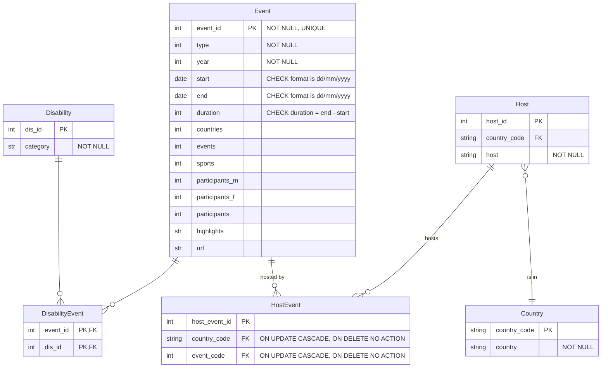

# 1. Update the database design diagram (ERD) based on requirements

You now know more about the application from the requirements (user stories) and the application design.

This stage is to review the ERD against these to determine if changes need to be made.

## Identifying new tables

Consider:

- class diagram from week 7
- ERD from week 4

### From the ERD

The ERD currently looks as follows:

### From the class diagram

As part of the activity to generate the application design diagram, you reviewed the user stories to identify potential
classes.

The final class diagram included classes such as:

- Event
- Country
- Disability
- Host
- Participants
- Student
- Teacher
- Chart
- Quiz
- Question
- AnswerChoice
- Response
- AccountController
- QuizController
- Chart
- FilterOptions

The Event class is split into Event and Participant in the class diagram.

Not all of these classes correspond to data that needs to be saved in a database. You only need to add data to the
database if it needs to be stored when the app is not running.

The controller classes in this example do not need to be stored in the database.

Charts and FilterOptions will be created dynamically when the app is running, but do not need to be saved to a database.

The Student does not log in so no Student details need to be saved, only their score for a quiz and their email address 
are optionally saved if they want to be considered for the competition of highest scorer for a quiz.

The Teacher details do not need to be stored. They will use the school single sign in and authorisation is checked when
they perform an action but is not saved. No record is kept of which teacher added each quiz, question etc.

Student answers are checked dynamically. Only their final score is saved to the database.

### Add the medal results table

For this week's activities, the data for both of the apps (quiz app, prediction app) are added to the same database.

## Draw the updated ERD
The revised ERD is:

## Add the new tables to the database

Creating tables was covered in week 4. The code is not included here since this is not the purpose of week 8's
activities.

[Next activity](8-2-select.md)