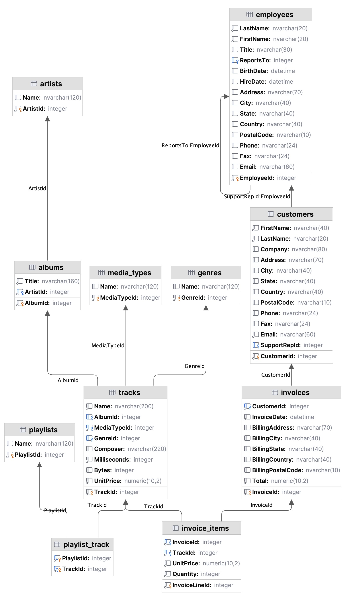

# 2. SQL SELECT queries

The examples in this activity use the [chinook database](https://github.com/lerocha/chinook-database) that is widely
used in SQL tutorials. The [SQLite tutorial](https://www.sqlitetutorial.net/sqlite-sample-database/) uses this database.

The ERD is:



You are then asked to write your own queries for the paralympics database. The version of the paralympics database to
use for this activity is [para_queries.db](../../src/tutorialpkg/data_db_activity/para_queries.db). This is based on
the ERD shown at the end of activity 8.1.

## SELECT query syntax

The core syntax of a query to find one or more rows or values from a table was covered in week 5:

```sqlite
SELECT column_names
FROM table_name
WHERE some_condition;
```

When executing queries with sqlite3 you can access the results using:

- `fetchall()` returns a list of tuples, each tuple contains field values of a row.
- `fetchone()` returns a row as a tuple.
- `fetchmany(size)` returns a specified number of rows as tuples.

In this tutorial, you will start to use some of the additional SQL clauses
for [SELECT](https://www.sqlite.org/lang_select.html):

```sqlite
SELECT DISTINCT column_list
FROM table_list
         JOIN table ON join_condition
WHERE row_filter
ORDER BY column_name
LIMIT count OFFSET offset
GROUP BY column
HAVING group_filter;
```

- ORDER BY to sort the results
- DISTINCT to query unique rows in a table
- WHERE to filter rows by a condition
- LIMIT to constrain the number of rows returned
- INNER JOIN or LEFT JOIN to query data from multiple tables
- GROUP BY clause to group rows into groups and apply aggregate functions to each group
- HAVING to filter groups on a condition

Run the example queries in the following
file: [tutorial8_select_queries.py](../../src/tutorialpkg/week8_queries/select_queries.py) by going to the 'main' and uncomment the line with `run_chinook_select_queries()`

```sqlite
-- 1. ORDER BY: Find all artist Name in 'artist' and order in reverse alphabetical order
SELECT Name 
FROM artists 
ORDER BY Name DESC;

-- 2. SELECT DISTINCT: Find all the uniques job titles from the employees table.
SELECT DISTINCT Title 
FROM employees;

-- 3. WHERE: Find all album names that include the words 'Dark' or 'Black'
SELECT Title from albums 
WHERE Title LIKE '%Dark%' OR Title LIKE '%Black%';

-- 4. LIMIT: Find 3 of the customer first names from the customers table
SELECT FirstName, LastName 
FROM customers 
LIMIT 3;

-- 5. GROUP BY clause to group rows into groups and apply aggregate functions to each group
-- The GROUP BY clause returns one row for each group. For each group, you can apply an aggregate function 
-- such as MIN, MAX, SUM, COUNT, or AVG to provide more information about each group.
-- example: Find the album id and the number of tracks per album.
SELECT albumid, COUNT(trackid)
FROM tracks
GROUP BY albumid;
    
-- 6. HAVING to filter groups on a condition
-- Find the numbers of tracks for the album with id 1
SELECT albumid, COUNT(trackid)
FROM tracks
GROUP BY albumid
HAVING albumid = 1;
```

Write your own queries for the following using the para_queries database:

1. Find all disability categories from the 'Disability' table and sort them in alphabetical order.
2. Find the unique 'region' names from the 'Country' table.
3. Find the start and end dates of all events that occurred in years between 1960 and 1969.
4. Find 5 country codes from the 'Host' table.
5. Find the event_id and number of teams in the MedalResult table for each Event.
6. Find the event_id and number of teams in the MedalResult table for event with event_id 27.
7. Find the event name and number of teams in the MedalResult table for event with event_id 27.
8. Find the year, host name, number of male participants and number of female participants in all winter games.
9. Find the year, event name, event type and rank for all events where the team from the Faroe Islands appear in the
   MedalResults.
10. Find the events that included the disability category 'Intellectual Disability' and sort them in alphabetical order.

Optionally, think of some of your own questions and write the queries.

[Next activity](8-3-join.md)
