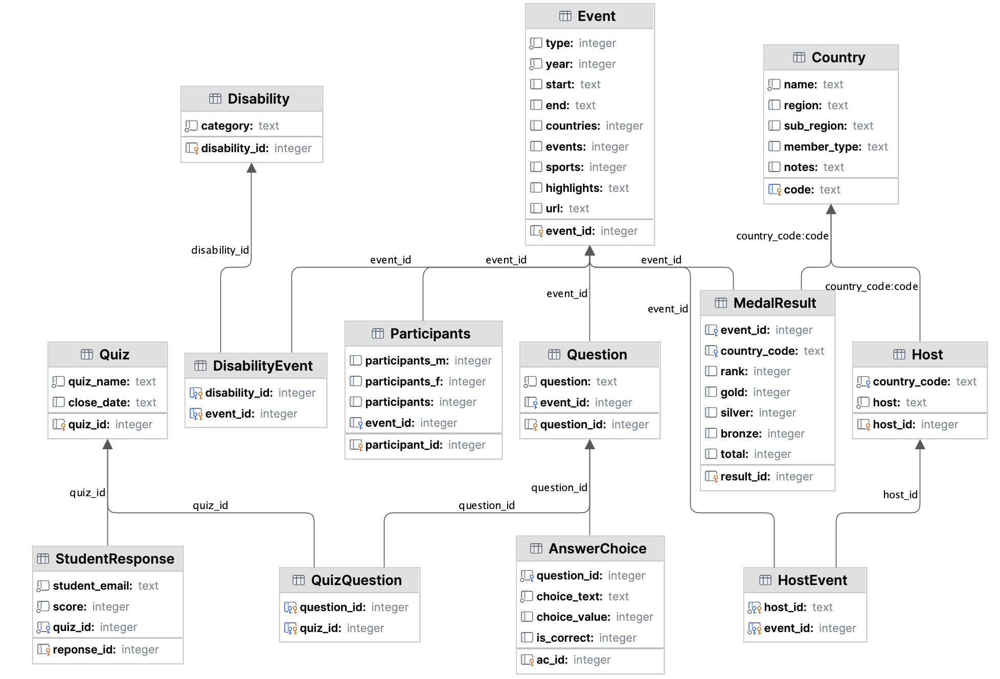

# 6. SQL DELETE queries

## Databases used

[Chinook database](../../src/tutorialpkg/data_db_activity/chinook.db):


[Paralympics query database](../../src/tutorialpkg/data_db_activity/para_queries.db):



## SQL DELETE

Reference links:

- [SQLite DELETE reference](https://www.sqlite.org/lang_delete.html)
- [SQLite DELETE tutorial](https://www.sqlitetutorial.net/sqlite-delete/)

The general syntax is:

```sqlite
DELETE FROM table
WHERE search_condition;
```

Specify the name of the table which you want to remove rows after the DELETE FROM keywords.

Add a search condition in the WHERE clause to identify the rows to remove. If you omit the WHERE clause, the DELETE
statement will delete all rows in the table.

## Chinook database DELETE examples

1. Delete all Artists where the Name is any of: New Artist 1, New Artist 2, New Artist 3, New Artist 4, New Artist 100
    ```sqlite
    DELETE FROM artists
    WHERE Name IN ('New Artist 1', 'New Artist 2', 'New Artist 3', 'New Artist 4', 'New Artist 100')
    ```
2. Delete all Albums where the title is New Album 100 or New Album 1
    ```sqlite
    DELETE FROM albums
    WHERE Title = 'New Album 1' OR 'New Album 100'
    ```

This assumes you ran the insert queries
in [tutorial8_insert_queries.py](../../src/tutorialpkg/week8_queries/insert_queries.py). Make sure you run
this before you try to delete or there will not be anything to delete!

Open [tutorial8_update_queries.py](../../src/tutorialpkg/week8_queries/update_queries.py) and view and run
the code.

## Paralympics data DELETE examples

Write code to:

1. Delete the quiz
2. Delete the questions
3. Delete the answer choices for the questions
