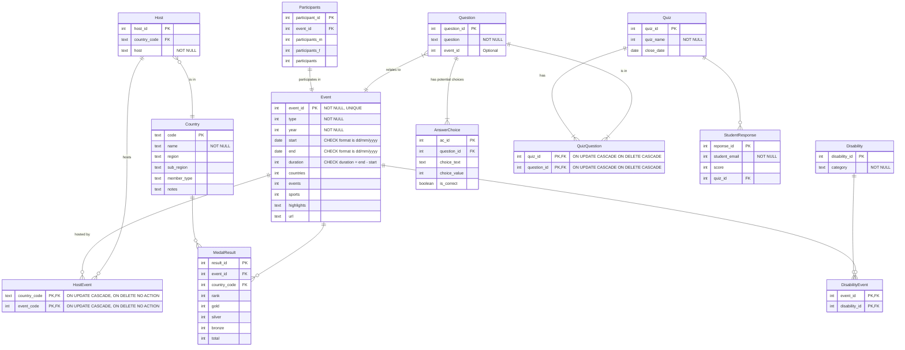

# Appendix: Final ERD

```mermaid
erDiagram
    Event {
        int event_id PK "NOT NULL, UNIQUE"
        int type "NOT NULL"
        int year "NOT NULL"
        date start "CHECK format is dd/mm/yyyy"
        date end "CHECK format is dd/mm/yyyy"
        int duration "CHECK duration = end - start"
        int countries
        int events
        int sports
        text highlights
        text url
    }

    Country {
        text code PK
        text name "NOT NULL"
        text region	
        text sub_region	
        text member_type	
        text notes
    }

    Disability {
        int disability_id PK
        text category "NOT NULL"
    }

    DisabilityEvent {
        int event_id PK, FK
        int disability_id PK, FK
    }

    Host {
        int host_id PK
        text country_code FK
        text host "NOT NULL"
    }

    HostEvent {
        text country_code PK, FK "ON UPDATE CASCADE, ON DELETE NO ACTION"
        int event_code PK, FK "ON UPDATE CASCADE, ON DELETE NO ACTION"
    }

    Participants {
        int participant_id PK
        int event_id FK
        int participants_m
        int participants_f
        int participants
    }

    MedalResult {
        int result_id PK
        int event_id FK
        int country_code FK
        int rank
        int gold
        int silver
        int bronze
        int total
    }

    Quiz {
        int quiz_id PK
        int quiz_name "NOT NULL"
        date close_date
    }

    Question {
        int question_id PK
        text question "NOT NULL"
        int event_id "Optional"
    }

    AnswerChoice {
        int ac_id PK
        int question_id FK
        text choice_text
        int choice_value
        boolean is_correct
    }

    QuizQuestion {
        int quiz_id PK, FK "ON UPDATE CASCADE ON DELETE CASCADE"
        int question_id PK, FK "ON UPDATE CASCADE ON DELETE CASCADE"
    }

    StudentResponse {
        int reponse_id PK
        int student_email "NOT NULL"
        int score
        int quiz_id FK
    }

    Event ||--o{ HostEvent: "hosted by"
    Disability ||--o{ DisabilityEvent: ""
    Event ||--o{ DisabilityEvent: ""
    Host ||--o{ HostEvent: hosts
    Host }o--|| Country: "is in"
    Participants ||--|| Event: "participates in"
    Quiz ||--|{ QuizQuestion: "has"
    Question ||--|{ QuizQuestion: "is in"
    Question }|--|| Event: "relates to"
    Question ||--|{ AnswerChoice: "has potential choices"
    Quiz ||--o{ StudentResponse: ""
    Country ||--o{ MedalResult: ""
    Event ||--o{ MedalResult: ""
```