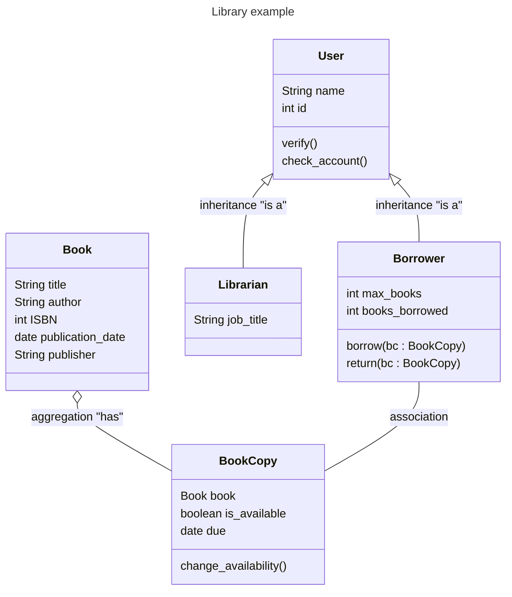

```mermaid
---
title: Library example
---
classDiagram
    class User {
        String name
        int id
        verify()
        check_account()
    }
    
    class Borrower {
        int max_books
        int books_borrowed
        borrow(bc : BookCopy)
        return(bc : BookCopy)
    }
    
    class Librarian {
        String job_title
    }
    
    class Book {
        String title
        String author
        int ISBN
        date publication_date
        String publisher
    }
    
    class BookCopy {
        Book book
        boolean is_available
        date due
        change_availability()
    }
    
    User <|-- Borrower : inheritance "is a"
    User <|-- Librarian : inheritance "is a"
    Book o-- BookCopy : aggregation "has"
    Borrower -- BookCopy : association

```