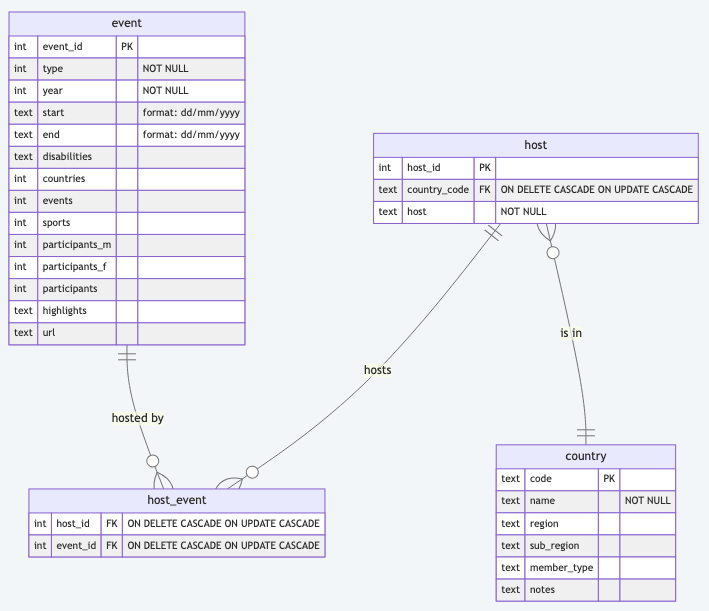
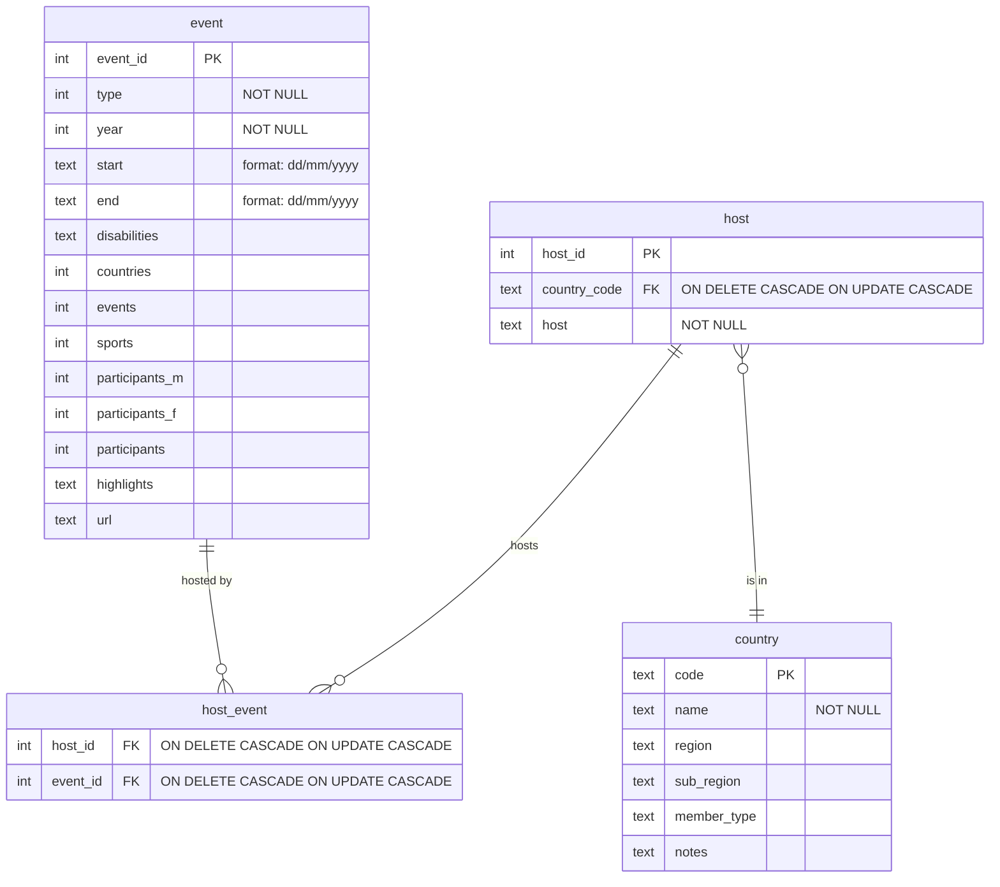

# A solution to week 4 ERD

## Enable mermaid support

The diagram in the markdown below uses [Mermaid](https://mermaid.js.org/syntax/entityRelationshipDiagram.html) to define
and display database diagrams. To view the diagram in the markdown you need to have this tool installed.

For PyCharm, Go to PyCharm | Settings | Plugins then search for
the [Mermaid plugin](https://plugins.jetbrains.com/plugin/20146-mermaid).

For VS Code, go to Code | Settings | Extensions and find
the [Mermaid chart extension](https://marketplace.visualstudio.com/publishers/MermaidChart).

## ERD

SQLite does not have a ['date' data type](https://www.sqlite.org/lang_datefunc.html). Dates can be stored as text or
integer.

